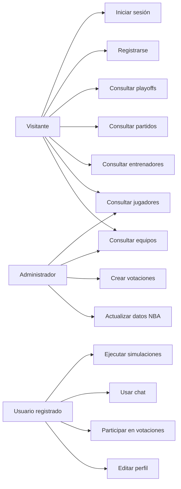
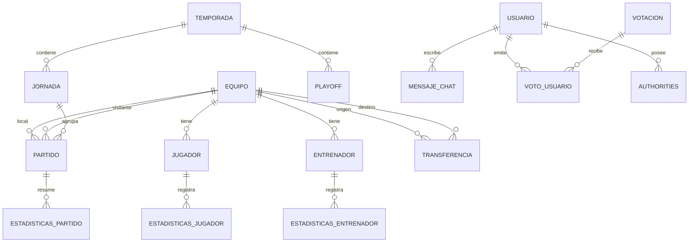
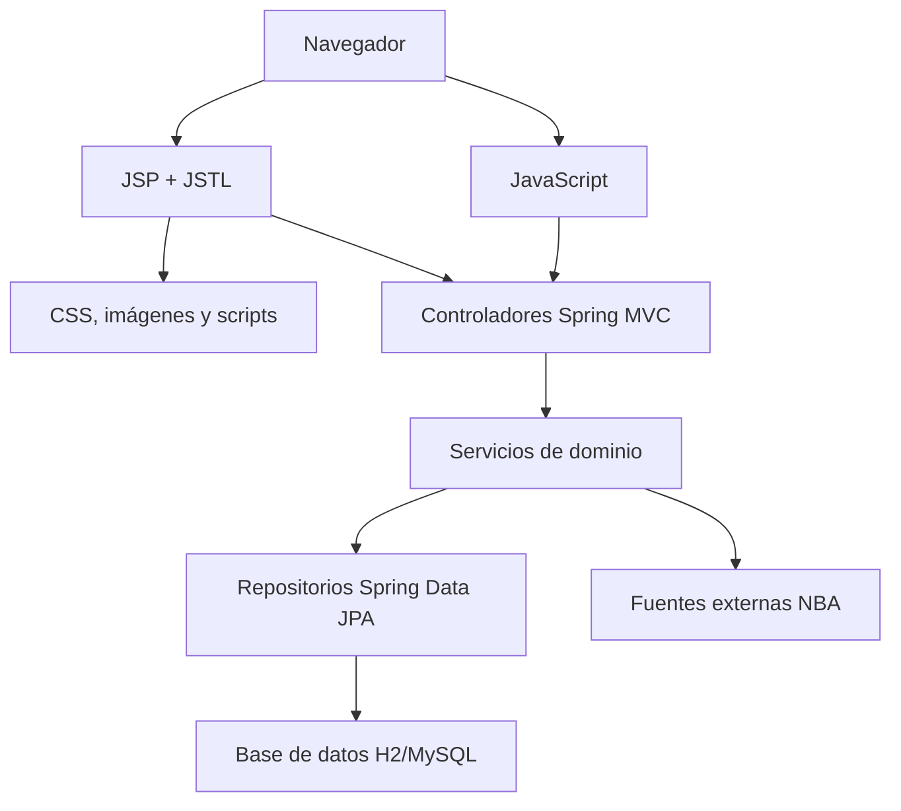
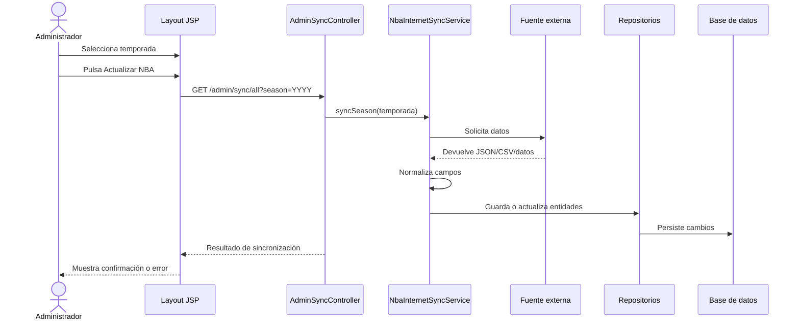
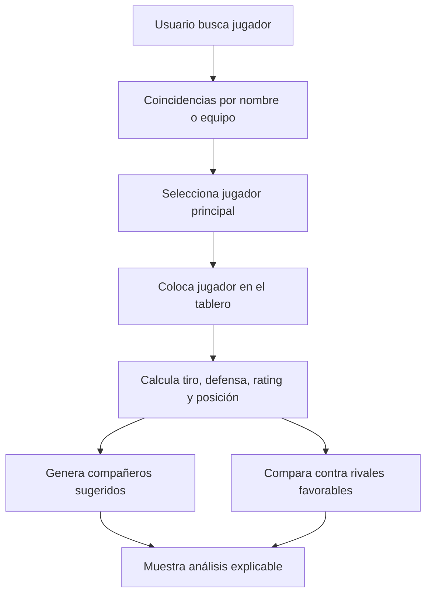

# Desarrollo de aplicación en Spring de datos simulados de NBA

**Trabajo Fin de Grado**  

**Grado en Ingeniería Informática**  

**Universidad de Sevilla**

Autor: Eduardo Pizarro López  

Tutor: Jesús Torres Valderrama  

Curso académico: 2025/2026  

Convocatoria: Tercera convocatoria

---

## Aviso de uso del documento

Este documento está preparado como borrador largo de memoria. La estructura está pensada para acercarse a una memoria técnica completa, con capítulos extensos, tablas, referencias, anexos y espacios para figuras. Para una entrega final conviene sustituir los campos entre corchetes, insertar capturas reales de la aplicación y adaptar algunas frases al criterio del tutor.

No se incluyen claves privadas, credenciales ni valores sensibles de configuración. Cuando se menciona el uso de APIs externas, se describe el mecanismo técnico sin reproducir tokens ni claves.

---

## Resumen

Este Trabajo Fin de Grado presenta el análisis, diseño e implementación de una aplicación web orientada a la consulta, gestión y simulación de información relacionada con la NBA. El sistema permite consultar equipos, jugadores, entrenadores, partidos, jornadas, temporadas, playoffs, transferencias, votaciones y noticias, además de incorporar funcionalidades de usuario como registro, autenticación, perfil, subida de imagen, chat y participación en votaciones.

El proyecto se ha desarrollado con Java 17 y Spring Boot, siguiendo una arquitectura basada en el patrón Modelo-Vista-Controlador. La capa de presentación se ha construido con JSP, JSTL, HTML, CSS y JavaScript; la capa de negocio se organiza mediante servicios; y la persistencia se apoya en entidades JPA y repositorios Spring Data JPA. La aplicación utiliza H2 como base de datos de desarrollo, manteniendo compatibilidad con bases de datos relacionales como MySQL.

Uno de los aspectos más relevantes del trabajo es la integración de datos NBA desde fuentes externas. Durante el desarrollo se estudiaron distintas alternativas: datos estáticos de respaldo, scraping de páginas deportivas, consumo de la API balldontlie y carga desde fuentes públicas basadas en ficheros. Este proceso permitió identificar limitaciones reales: cambios en estructuras HTML, restricciones de términos de uso, límites de llamadas en APIs gratuitas y necesidad de normalizar datos externos para adaptarlos al modelo interno de la aplicación.

Además de la parte de consulta, se ha incorporado un módulo de simulación deportiva. Este módulo utiliza un modelo heurístico con componentes probabilísticos simples. No se trata de un sistema profesional de predicción ni de un modelo de aprendizaje automático entrenado, sino de una capa analítica explicable que utiliza métricas internas como edad, experiencia, historial All-Star, posición, estadísticas acumuladas, tiro, defensa, equilibrio de plantilla y necesidades por equipo. El módulo permite simular temporadas, brackets de playoffs, partidos en directo, traspasos, dinastías e incluso analizar quintetos mediante un tablero visual inspirado en una pista NBA.

En la fase final se añadió una sección de comparativa histórica. Esta vista permite seleccionar dos temporadas cargadas, filtrar equipos, limitar el volumen de jugadores mostrados, comparar estadísticas agregadas y descargar gráficas en formato SVG. También permite construir una plantilla nueva de entre ocho y doce jugadores y simular el efecto de sustituir un jugador por otro dentro de una temporada concreta.

Finalmente, se ha realizado un rediseño visual de la aplicación para unificar botones, formularios, tablas, tarjetas, contenedores, tipografía, paleta de color y comportamiento responsive. El resultado es una aplicación funcional y demostrable que combina desarrollo backend, frontend, seguridad, integración externa, datos deportivos y simulación aplicada al baloncesto.

**Palabras clave:** Spring Boot, Java, JSP, JPA, NBA, simulación deportiva, análisis heurístico, aplicación web, scraping, API, responsive design.

---

## Abstract

This Final Degree Project presents the analysis, design and implementation of a web application focused on browsing, managing and simulating NBA-related information. The system allows users to consult teams, players, coaches, games, rounds, seasons, playoffs, transfers, voting processes and news. It also includes user-oriented features such as registration, authentication, profile management, avatar upload, chat and voting participation.

The project has been developed with Java 17 and Spring Boot, following a Model-View-Controller architecture. The presentation layer is built with JSP, JSTL, HTML, CSS and JavaScript; the business layer is organized through services; and persistence is implemented using JPA entities and Spring Data JPA repositories. The application uses H2 as its development database while keeping compatibility with relational databases such as MySQL.

One of the most relevant parts of the project is the integration of NBA data from external sources. Several approaches were studied during development: static backup data, web scraping, the balldontlie API and public file-based datasets. This process revealed practical limitations such as changing HTML structures, usage restrictions, API rate limits and the need to normalize external data into the internal domain model.

In addition to data browsing, a sports simulation module has been implemented. This module uses a heuristic model with simple probabilistic components. It is not a professional prediction engine nor a trained machine learning model, but an explainable analytical layer based on internal metrics such as age, experience, All-Star history, position, accumulated statistics, shooting, defense, roster balance and team needs. It supports season simulation, playoff bracket simulation, live game simulation, trade analysis, dynasty projection and a lineup board inspired by an NBA court.

Finally, the user interface has been redesigned to unify buttons, forms, tables, cards, containers, typography, color palette and responsive behavior. The final result is a functional and demonstrable application that combines backend development, frontend design, security, external data integration, sports data and basketball-oriented simulation.

**Keywords:** Spring Boot, Java, JSP, JPA, NBA, sports simulation, heuristic analysis, web application, scraping, API, responsive design.

---

# Índice general

1. Introducción  
   1.1. Contexto del proyecto  
   1.2. Motivación  
   1.3. Objetivos  
   1.4. Alcance del sistema  
   1.5. Estructura de la memoria  
2. Estado del arte  
   2.1. Aplicaciones deportivas y plataformas NBA  
   2.2. Consulta de estadísticas deportivas  
   2.3. APIs deportivas y fuentes externas  
   2.4. Scraping web aplicado a datos deportivos  
   2.5. Simulación y análisis predictivo en deporte  
3. Planificación y metodología  
   3.1. Metodología de desarrollo  
   3.2. Desarrollo iterativo por hitos  
   3.3. Evolución del proyecto durante dos años  
   3.4. Riesgos y problemas encontrados  
   3.5. Estimación temporal y costes  
4. Análisis de requisitos  
   4.1. Actores del sistema  
   4.2. Requisitos funcionales  
   4.3. Requisitos no funcionales  
   4.4. Casos de uso principales  
   4.5. Modelo de dominio  
5. Diseño del sistema  
   5.1. Arquitectura general  
   5.2. Patrón MVC con Spring Boot  
   5.3. Diseño de la base de datos  
   5.4. Diseño de la interfaz  
   5.5. Diseño responsive  
   5.6. Seguridad y control de acceso  
   5.7. Integración con fuentes externas  
   5.8. Diseño del módulo de simulaciones  
6. Tecnologías utilizadas  
   6.1. Java y Spring Boot  
   6.2. Spring MVC, Spring Security y Spring Data JPA  
   6.3. JSP, JSTL, JavaScript, HTML y CSS  
   6.4. Maven y base de datos  
   6.5. Jsoup, OpenCSV y Jackson  
   6.6. APIs externas y fuentes de datos NBA  
   6.7. Herramientas de pruebas  
7. Implementación  
   7.1. Estructura del proyecto  
   7.2. Gestión de usuarios y perfiles  
   7.3. Gestión de equipos, jugadores y entrenadores  
   7.4. Gestión de partidos, temporadas y playoffs  
   7.5. Transferencias, votaciones y chat  
   7.6. Marcador en directo y noticias  
   7.7. Administración y sincronización de datos  
   7.8. Filtros, buscadores y experiencia de usuario  
8. Obtención e integración de datos NBA  
   8.1. Datos iniciales estáticos  
   8.2. Intento de scraping con Basketball Reference  
   8.3. Uso de la API balldontlie y limitaciones  
   8.4. Carga de datos desde fuentes externas  
   8.5. Adaptación de los datos al modelo interno  
   8.6. Datos de respaldo  
9. Simulaciones y análisis deportivo  
   9.1. Objetivo del módulo  
   9.2. Cálculo de rating de jugadores y equipos  
   9.3. Predicción de playoffs  
   9.4. Simulación de bracket  
   9.5. Simulación de temporada  
   9.6. Simulación de partido en directo  
   9.7. Análisis de traspasos  
   9.8. Análisis de dinastías  
   9.9. Tablero de quintetos y recomendaciones  
   9.10. Limitaciones del modelo  
10. Pruebas y validación  
    10.1. Estrategia de pruebas  
    10.2. Pruebas funcionales  
    10.3. Pruebas de interfaz  
    10.4. Pruebas de seguridad  
    10.5. Pruebas de sincronización de datos  
    10.6. Pruebas del módulo de simulación  
    10.7. Resultados obtenidos  
11. Conclusiones y trabajo futuro  
    11.1. Objetivos alcanzados  
    11.2. Dificultades encontradas  
    11.3. Valoración personal  
    11.4. Mejoras futuras  
Bibliografía  
Anexos  
Anexo A. Manual de instalación y ejecución local  
Anexo B. Manual de usuario  
Anexo C. Manual de administrador  

---

# Índice de figuras

Figura 1. Pantalla principal de la aplicación.  
Figura 2. Navegación superior y selector de temporada.  
Figura 3. Listado de equipos NBA.  
Figura 4. Detalle de equipo.  
Figura 5. Listado de jugadores y entrenadores.  
Figura 6. Vista de partidos.  
Figura 7. Vista de playoffs.  
Figura 8. Sistema de votaciones.  
Figura 9. Perfil de usuario.  
Figura 10. Formulario de edición de perfil.  
Figura 11. Chat de usuarios.  
Figura 12. Marcador en directo.  
Figura 13. Página de simulaciones.  
Figura 14. Simulación de temporada.  
Figura 15. Simulación de playoffs.  
Figura 16. Análisis de traspasos.  
Figura 17. Tablero de quintetos.  
Figura 18. Resultado del análisis de quinteto.  
Figura 19. Pantalla de carga de actualización NBA.  
Figura 20. Pantalla de error personalizada.  
Figura 21. Diagrama de arquitectura general.  
Figura 22. Diagrama entidad-relación.  
Figura 23. Diagrama de casos de uso.  
Figura 24. Flujo de autenticación.  
Figura 25. Flujo de actualización de datos externos.  
Figura 26. Flujo de simulación de playoffs.  
Figura 27. Flujo de análisis del tablero de quintetos.  
Figura 28. Comparativa de temporadas y exportación de gráficas.  
Figura 29. Simulación de plantilla nueva y traspaso histórico.

---

# Índice de tablas

Tabla 1. Objetivos específicos del proyecto.  
Tabla 2. Hitos de desarrollo.  
Tabla 3. Estimación temporal.  
Tabla 4. Riesgos del proyecto.  
Tabla 5. Actores del sistema.  
Tabla 6. Requisitos funcionales.  
Tabla 7. Requisitos no funcionales.  
Tabla 8. Entidades principales.  
Tabla 9. Tecnologías utilizadas.  
Tabla 10. Comparativa de fuentes externas.  
Tabla 11. Métricas del módulo de simulación.  
Tabla 12. Pruebas funcionales.  
Tabla 13. Pruebas de interfaz.  
Tabla 14. Pruebas de seguridad.  
Tabla 15. Mejoras futuras.  
Tabla 16. Métricas de comparativa histórica.

---

# 1. Introducción

## 1.1 Contexto del proyecto

El deporte profesional se ha convertido en un ámbito estrechamente relacionado con la tecnología y el análisis de datos. En competiciones como la NBA, cada partido genera una gran cantidad de información: resultado final, anotación por cuarto, estadísticas individuales, estadísticas de equipo, traspasos, rendimiento histórico, clasificaciones, lesiones, contratos y tendencias competitivas. La forma en la que los aficionados consumen esta información también ha cambiado. Ya no basta con mostrar el resultado de un partido; cada vez se espera más contexto, más filtrado, más comparación y más capacidad de interacción.

Este proyecto se sitúa dentro de ese contexto. Su objetivo es construir una aplicación web que permita consultar información relacionada con la NBA y, además, utilizar esos datos para generar simulaciones y análisis. La idea principal no es replicar una plataforma oficial, sino crear un sistema académico completo que reúna diferentes bloques técnicos: desarrollo web con Spring Boot, persistencia de datos, seguridad, vistas JSP, JavaScript, consumo de fuentes externas y lógica de análisis deportivo.

La elección de la NBA como dominio resulta adecuada porque ofrece un modelo de datos amplio. Existen equipos, jugadores, entrenadores, temporadas, partidos, jornadas, playoffs, votaciones, traspasos y estadísticas. Cada elemento puede relacionarse con otros, lo que permite trabajar con entidades JPA y relaciones entre tablas. Además, la existencia de fuentes externas permite explorar problemas reales de integración de datos: APIs limitadas, datos históricos en ficheros públicos, páginas web con estructura cambiante y necesidad de mantener datos de respaldo.

Desde el punto de vista de ingeniería, el proyecto permite demostrar el ciclo completo de una aplicación: análisis, diseño, implementación, pruebas, documentación y mejora iterativa. La aplicación se ha desarrollado con Java 17 y Spring Boot, tecnologías muy extendidas en el desarrollo de aplicaciones empresariales. Spring Boot simplifica la creación de aplicaciones Java autocontenidas y proporciona integración con Spring MVC, Spring Security y Spring Data JPA [Spring Boot Documentation](https://docs.spring.io/spring-boot/reference/).

La arquitectura utilizada sigue el patrón Modelo-Vista-Controlador. Este patrón separa la representación de datos, la interfaz de usuario y el flujo de control, lo que facilita el mantenimiento y la evolución del sistema. La idea original de MVC fue descrita por Trygve Reenskaug en 1979 [Reenskaug, 1979](https://doi.org/10.5281/zenodo.3676092), y continúa siendo una referencia habitual en aplicaciones web.

**Figura 1. Pantalla principal de la aplicación.**  
[Insertar captura de la página principal con la navegación superior visible.]

## 1.2 Motivación

La motivación inicial del proyecto fue construir una aplicación web completa utilizando tecnologías vistas durante el grado. Sin embargo, a medida que el desarrollo avanzó, el proyecto dejó de ser únicamente una aplicación CRUD y pasó a incluir funcionalidades más ambiciosas. El dominio NBA permitió incorporar filtros, vistas de detalle, navegación por equipos, perfiles de usuario, votaciones, chat, noticias, actualización de datos externos y simulaciones.

Otra motivación importante fue la posibilidad de trabajar con datos reales. En una aplicación deportiva, la calidad de los datos condiciona el valor del sistema. Por ello se investigaron varias alternativas para alimentar la aplicación. En primer lugar se usaron datos estáticos en `data.sql`, lo que garantizaba que la aplicación pudiera funcionar siempre. Posteriormente se exploró el scraping de páginas deportivas, especialmente Basketball Reference. Más adelante se integró la API balldontlie, que ofrece endpoints para equipos, jugadores, partidos y estadísticas NBA [balldontlie NBA API](https://docs.balldontlie.io/). Finalmente se incorporó un sistema de sincronización por temporada apoyado en fuentes públicas.

Durante este proceso se comprobó que obtener datos deportivos no es trivial. Las páginas web pueden modificar etiquetas, ocultar tablas o restringir acceso automatizado. Las APIs pueden imponer límites de llamadas o requerir planes de pago. Los datasets públicos pueden tener nombres de equipos o formatos distintos al modelo interno. Estas dificultades forman parte del valor técnico del proyecto, porque obligan a diseñar una arquitectura con tolerancia a fallos y datos de respaldo.

También existió una motivación relacionada con la experiencia de usuario. Al tratarse de una aplicación que fue creciendo durante un periodo largo, algunas pantallas tenían estilos distintos. Se decidió rediseñar la interfaz para que toda la aplicación compartiera una estética uniforme, moderna y profesional, con una paleta inspirada en la NBA y comportamiento responsive.

## 1.3 Objetivos

El objetivo general del proyecto es desarrollar una aplicación web sobre la NBA que permita consultar, gestionar y analizar información deportiva mediante una interfaz clara y coherente.

Los objetivos específicos se muestran en la Tabla 1.

**Tabla 1. Objetivos específicos del proyecto.**

| Código | Objetivo |
| --- | --- |
| OBJ-01 | Diseñar un modelo de datos para equipos, jugadores, entrenadores, temporadas, jornadas, partidos, playoffs, transferencias, usuarios, votaciones y mensajes. |
| OBJ-02 | Implementar una aplicación web con Spring Boot siguiendo una arquitectura por capas. |
| OBJ-03 | Utilizar JSP, JSTL, HTML, CSS y JavaScript para la capa de presentación. |
| OBJ-04 | Incorporar autenticación, autorización y roles mediante Spring Security. |
| OBJ-05 | Permitir consulta y filtrado de información deportiva. |
| OBJ-06 | Mantener datos estáticos de respaldo. |
| OBJ-07 | Explorar integración con APIs, scraping y fuentes públicas. |
| OBJ-08 | Implementar actualización de datos NBA por temporada. |
| OBJ-09 | Añadir simulaciones y análisis deportivo explicables. |
| OBJ-10 | Rediseñar la interfaz para mejorar uniformidad visual y responsive design. |
| OBJ-11 | Validar los flujos principales mediante pruebas funcionales y de interfaz. |
| OBJ-12 | Incorporar comparativas entre temporadas, plantillas nuevas y traspasos con gráficas descargables. |

## 1.4 Alcance del sistema

El alcance del proyecto incluye funcionalidades públicas, funcionalidades de usuario registrado y funcionalidades de administración.

El usuario visitante puede consultar contenidos generales como equipos, jugadores, entrenadores, partidos, temporadas, playoffs, transferencias, noticias, marcador y simulaciones disponibles. El usuario registrado puede acceder a su perfil, modificar datos personales, subir una imagen de avatar, cambiar la contraseña, participar en votaciones y utilizar el chat. El administrador puede crear votaciones y ejecutar procesos de actualización de datos NBA mediante el selector de temporada.

El sistema no pretende ser una herramienta oficial de la NBA ni una plataforma de predicción profesional. Las simulaciones tienen finalidad académica, demostrativa y analítica. Se basan en métricas disponibles en la aplicación y en reglas heurísticas diseñadas para ser comprensibles. Esta decisión es importante porque evita presentar el sistema como algo más avanzado de lo que realmente es. El valor del módulo reside en integrar datos deportivos con cálculos explicables dentro de una aplicación web funcional.

## 1.5 Estructura de la memoria

La memoria se organiza en once capítulos principales. El primer capítulo introduce el contexto, la motivación, los objetivos y el alcance del sistema. El segundo capítulo revisa el estado del arte relacionado con aplicaciones deportivas, estadísticas NBA, APIs, scraping y simulación deportiva. El tercer capítulo presenta la planificación y la metodología seguida, teniendo en cuenta que el proyecto se desarrolló durante aproximadamente dos años con pausas y retomadas sucesivas.

El cuarto capítulo recoge el análisis de requisitos, actores, casos de uso y modelo de dominio. El quinto capítulo describe el diseño del sistema, incluyendo arquitectura, MVC, base de datos, interfaz, seguridad, integración externa y módulo de simulaciones. El sexto capítulo resume las tecnologías utilizadas. El séptimo capítulo explica la implementación de los módulos principales: usuarios, equipos, jugadores, partidos, playoffs, votaciones, chat, marcador, administración, filtros y buscadores.

El octavo capítulo se centra en la obtención e integración de datos NBA, incluyendo datos estáticos, intentos de scraping, uso de APIs y normalización hacia el modelo interno. El noveno capítulo desarrolla el módulo de simulaciones y análisis deportivo. El décimo capítulo recoge la estrategia de pruebas y validación. Por último, el undécimo capítulo presenta las conclusiones, dificultades encontradas, valoración personal y líneas de trabajo futuro.

Tras el cuerpo principal se incluyen bibliografía y anexos. Estos anexos contienen el manual de instalación y ejecución local, el manual de usuario, el manual de administrador, diagramas, capturas recomendadas, trazabilidad, explicación detallada de algoritmos y material de apoyo para la defensa.

La aportación principal del trabajo queda repartida en esos bloques: construcción de una aplicación web completa sobre un dominio deportivo real, integración de fuentes externas, mantenimiento de datos de respaldo y creación de simulaciones explicables conectadas con los datos gestionados por la propia aplicación.

---

# 2. Estado del arte

## 2.1 Aplicaciones deportivas y plataformas NBA

Las aplicaciones deportivas actuales combinan consulta de datos, resultados en directo, noticias, estadísticas, personalización y análisis. La NBA dispone de un ecosistema amplio de plataformas oficiales y no oficiales. NBA.com ofrece información oficial, calendario, noticias, estadísticas y contenido multimedia. Basketball Reference se orienta a datos históricos y estadísticas avanzadas. FiveThirtyEight ha ofrecido modelos de predicción y datos históricos basados en ratings Elo. APIs como balldontlie proporcionan acceso estructurado a datos deportivos mediante peticiones HTTP.

El proyecto toma estos sistemas como referencia conceptual, pero con un alcance académico. La finalidad no es competir con plataformas existentes, sino construir una aplicación propia que reúna funcionalidades de consulta, gestión y simulación.

## 2.2 Estadística deportiva y baloncesto

El baloncesto es un deporte especialmente adecuado para el análisis de datos. Cada posesión puede generar eventos medibles: lanzamiento, asistencia, rebote, pérdida, robo, tapón o falta. A partir de estos eventos se pueden construir métricas individuales y colectivas.

Dean Oliver popularizó una visión analítica del baloncesto basada en factores como tiro, pérdidas, rebote y tiros libres. Basketball Reference resume estos "Four Factors" como tiro, pérdidas, rebote y tiros libres, asignando importancia aproximada a cada uno [Basketball Reference, Four Factors](https://www.basketball-reference.com/about/factors.html). Aunque este proyecto no implementa exactamente esos factores, sí utiliza una filosofía similar: transformar estadísticas disponibles en indicadores comparables.

En la aplicación, las métricas disponibles se adaptan a los datos existentes. Por ejemplo, el tiro se aproxima mediante triples anotados, tiros de campo y tiros libres; la defensa se aproxima mediante rebotes, tapones, robos y posición; y el valor general del jugador se estima mediante edad, experiencia, historial All-Star y producción acumulada.

## 2.3 APIs deportivas

Las APIs permiten obtener datos estructurados sin depender de la estructura visual de una página web. La API balldontlie ofrece endpoints para equipos, jugadores, partidos y estadísticas NBA [balldontlie API](https://docs.balldontlie.io/). Su ventaja principal es que devuelve JSON con campos predecibles. Su limitación es que requiere clave de API, maneja paginación y aplica límites de uso.

En un proyecto académico, estas restricciones son relevantes. Una API puede funcionar correctamente para consultas puntuales, pero resultar insuficiente para cargar muchos años de datos si el plan gratuito limita llamadas. Por ello, una arquitectura robusta debe prever alternativas.

## 2.4 Scraping web

El scraping permite extraer información de páginas HTML. En Java, jsoup es una biblioteca muy utilizada para parsear HTML real y seleccionar elementos mediante selectores CSS [jsoup Documentation](https://jsoup.org/apidocs/). El proyecto incluye servicios y DTOs relacionados con scraping de equipos, jugadores, entrenadores, partidos, temporadas, jornadas y playoffs.

El principal inconveniente del scraping es su fragilidad. Una tabla puede cambiar de clase CSS, una columna puede desaparecer o una web puede incluir datos comentados, generados dinámicamente o protegidos. Además, deben respetarse condiciones de uso. Sports Reference advierte sobre el uso automatizado y la reutilización masiva de datos [Sports Reference Data Use](https://www.sports-reference.com/data_use.html).

Por este motivo, el scraping se consideró una línea experimental y no la base única del sistema.

## 2.5 Fuentes públicas de datos históricos

FiveThirtyEight publicó datasets de partidos y ratings Elo NBA. Estos datos incluyen temporada, equipos, resultados, indicadores de playoff, ratings previos y probabilidades Elo [FiveThirtyEight NBA Elo Data](https://fivethirtyeightdata.github.io/fivethirtyeightdata/reference/nba_elo.html). Este tipo de fuente es útil porque permite cargar muchos partidos desde un fichero, evitando realizar una petición por cada entidad.

La desventaja es que el formato externo no coincide necesariamente con el modelo interno. Por ejemplo, puede ser necesario transformar nombres de equipos, abreviaturas y temporadas. Esta normalización se convierte en una parte importante del diseño.

## 2.6 Simulación y predicción deportiva

La predicción deportiva puede realizarse mediante modelos simples o complejos. Los sistemas Elo asignan ratings a equipos y actualizan esos ratings según resultados. FiveThirtyEight explica cómo ha utilizado ratings, localía, disponibilidad de jugadores y otros factores para estimar probabilidades de victoria [FiveThirtyEight NBA Predictions](https://fivethirtyeight.com/methodology/how-our-nba-predictions-work/).

El proyecto no implementa Elo completo ni machine learning, pero toma como referencia la idea de convertir características de equipo en una puntuación comparable. La simulación de series utiliza probabilidades relativas basadas en rating de equipo. La simulación de partido en directo utiliza puntuaciones aleatorias dentro de rangos razonables. El análisis de traspasos utiliza reglas de scoring.

## 2.7 Comparativa de soluciones similares

Para situar el proyecto dentro del contexto existente, se analizaron varias soluciones relacionadas con la consulta de información NBA. La comparación no se realiza con intención competitiva, sino para identificar qué funcionalidades son habituales y qué hueco podía cubrir una aplicación académica propia.

| Solución | Tipo de sistema | Puntos fuertes | Limitaciones para este proyecto |
| --- | --- | --- | --- |
| NBA.com | Plataforma oficial | Información actual, noticias, calendario, multimedia | No permite adaptar libremente el modelo ni estudiar el backend |
| Basketball Reference | Base estadística histórica | Gran cantidad de datos históricos y tablas detalladas | Scraping frágil y restricciones de uso automatizado |
| FiveThirtyEight NBA | Predicción y datos históricos | Modelos explicados, datos Elo y enfoque analítico | No cubre gestión de usuarios ni vistas propias de aplicación |
| balldontlie | API deportiva | Datos estructurados en JSON | Límites de llamadas y dependencia de clave/API externa |
| Aplicación desarrollada | Aplicación web académica | Control completo, integración propia, simulaciones y usuarios | Precisión limitada por datos disponibles y alcance académico |

La comparación anterior permite justificar el enfoque del trabajo. Las plataformas existentes tienen mayor volumen de datos o mayor precisión predictiva, pero no permiten estudiar internamente una arquitectura completa adaptada al TFG. En cambio, la aplicación desarrollada permite controlar el modelo de datos, la interfaz, la seguridad, la lógica de negocio y las simulaciones.

## 2.8 Conclusiones del estado del arte

Del estudio realizado se extraen varias conclusiones. En primer lugar, los datos deportivos tienen gran valor, pero su obtención no siempre es sencilla. En segundo lugar, las soluciones de predicción más avanzadas se apoyan en métricas y modelos complejos que requieren muchos datos históricos. En tercer lugar, para un proyecto académico resulta razonable construir un sistema explicable, aunque sus predicciones sean más simples.

Estas conclusiones influyen directamente en el diseño del proyecto. Se decide mantener datos de respaldo, evitar una dependencia absoluta del scraping, aprovechar APIs cuando sea posible y construir simulaciones basadas en reglas transparentes. De esta forma, el sistema queda alineado con los objetivos del TFG y no depende de prometer una precisión que no se puede garantizar con los datos disponibles.

---

# 3. Planificación y metodología

## 3.1 Metodología de desarrollo

El proyecto se ha desarrollado durante aproximadamente dos años, con pausas, revisiones y ampliaciones de alcance. Debido a esa realidad, la metodología más honesta no es Scrum estricto, ya que no existieron sprints cerrados, ceremonias regulares ni entregas periódicas fijas. La metodología seguida se ajusta mejor a un desarrollo iterativo por hitos.

Cada hito representó un avance funcional o técnico concreto. Esta organización permitió trabajar de forma flexible, retomar el proyecto tras pausas y añadir nuevas funcionalidades sin reconstruir todo el sistema desde cero.

## 3.2 Hitos del proyecto

**Tabla 2. Hitos de desarrollo.**

| Hito | Descripción | Resultado |
| --- | --- | --- |
| H1 | Configuración inicial | Proyecto Spring Boot con Maven |
| H2 | Modelo de dominio | Entidades JPA principales |
| H3 | Persistencia | Repositorios y servicios básicos |
| H4 | Vistas iniciales | JSP para consulta de datos |
| H5 | Seguridad | Registro, login, roles y BCrypt |
| H6 | Datos estáticos | Carga mediante `data.sql` |
| H7 | Participación | Chat, votaciones y perfil |
| H8 | Filtros | Buscadores por equipo, temporada y texto |
| H9 | Rediseño UI | Estilo visual NBA y responsive |
| H10 | Fuentes externas | API, scraping y carga por temporada |
| H11 | Simulaciones | Temporada, playoffs, trades, tablero |
| H12 | Revisión final | Correcciones visuales y documentación |

## 3.3 Cronología aproximada

El trabajo no siguió una dedicación continua. Hubo periodos de desarrollo intenso y otros de pausa. En una memoria académica esto puede explicarse como evolución por fases.

**Tabla 3. Estimación temporal.**

| Fase | Tiempo aproximado |
| --- | ---: |
| Análisis inicial del dominio | 40 h |
| Configuración y arquitectura base | 80 h |
| Modelo de datos y persistencia | 100 h |
| Funcionalidades de consulta | 140 h |
| Usuarios, roles y seguridad | 80 h |
| Chat, votaciones y perfil | 70 h |
| Integración de datos externos | 120 h |
| Rediseño visual responsive | 100 h |
| Simulaciones y tablero | 140 h |
| Pruebas y correcciones | 80 h |
| Documentación y preparación | 90 h |
| Total aproximado | 1040 h |

Esta estimación no debe interpretarse como un registro exacto minuto a minuto, sino como una distribución razonable del esfuerzo realizado durante el periodo de desarrollo.

## 3.4 Riesgos

**Tabla 4. Riesgos del proyecto.**

| Riesgo | Impacto | Medida aplicada |
| --- | --- | --- |
| Cambios en HTML de páginas externas | Alto | No depender solo del scraping |
| Límite de llamadas de API | Alto | Mantener datos estáticos y ficheros públicos |
| Datos incompletos | Medio | Reglas con valores seguros y límites |
| Inconsistencia visual | Medio | Rediseño global de CSS |
| Caracteres corruptos | Medio | Forzar UTF-8 y corregir textos |
| Pérdida de funcionalidad al rediseñar | Alto | Mantener lógica backend y cambiar solo vistas/CSS |
| Dificultad para defender simulaciones | Medio | Explicar modelo heurístico y limitaciones |

## 3.5 Costes

El coste económico directo del proyecto ha sido reducido porque se han utilizado herramientas gratuitas o de código abierto. El coste principal ha sido el tiempo de desarrollo. Para una estimación académica, puede valorarse el trabajo con una tarifa orientativa. Si se aplica una tarifa de 12 euros/hora a 1040 horas, el coste humano aproximado sería 12.480 euros. Si se aplica una tarifa de 15 euros/hora, el coste sería 15.600 euros.

No se incluyen costes de licencias comerciales. El uso de APIs externas se mantuvo en un nivel compatible con el desarrollo académico y no se contrataron planes de pago.

## 3.6 Recursos utilizados

Los recursos empleados se pueden dividir en recursos hardware, software y fuentes de información. El desarrollo se realizó en un equipo personal, utilizando un entorno local con Java, Maven, editor de código, navegador web y base de datos H2. Este enfoque permitió iterar de forma rápida sin depender de infraestructura externa.

En cuanto a recursos software, se utilizaron tecnologías de código abierto o de libre acceso para el desarrollo académico. Spring Boot, Spring Security, Spring Data JPA, H2, jsoup, Jackson y Maven forman parte del ecosistema Java y permiten construir una aplicación completa sin asumir costes de licencia.

Respecto a fuentes de información, se consultó documentación oficial de las tecnologías utilizadas y fuentes públicas relacionadas con datos NBA. Esta distinción es importante: no todas las fuentes consultadas terminaron integradas en la aplicación, pero sí influyeron en las decisiones de diseño.

## 3.7 Seguimiento y control del desarrollo

El seguimiento del proyecto se realizó de forma incremental. Cada avance funcional se probaba directamente en la aplicación antes de pasar al siguiente bloque. Esta estrategia fue especialmente útil porque la aplicación combina muchas secciones visuales, y un cambio global de estilo podía afectar a pantallas creadas en fases anteriores.

Durante la fase final, el control se centró en tres aspectos:

- Evitar pérdida de funcionalidad al rediseñar vistas.
- Detectar problemas visuales en formularios, tablas, botones y contenedores.
- Comprobar que las nuevas funcionalidades de simulación se integraban con datos existentes.

Este seguimiento permitió corregir problemas como márgenes insuficientes, selectores poco legibles, caracteres corruptos, imágenes no cargadas y diferencias visuales entre secciones.

---

# 4. Análisis de requisitos

## 4.1 Actores

**Tabla 5. Actores del sistema.**

| Actor | Descripción |
| --- | --- |
| Visitante | Usuario no autenticado que consulta información pública |
| Usuario registrado | Usuario autenticado con acceso a perfil, chat y votaciones |
| Administrador | Usuario con permisos para crear votaciones y actualizar datos |

## 4.2 Requisitos funcionales

**Tabla 6. Requisitos funcionales.**

| Código | Requisito |
| --- | --- |
| RF01 | Consultar listado de equipos NBA |
| RF02 | Consultar detalle de un equipo |
| RF03 | Consultar jugadores |
| RF04 | Consultar entrenadores |
| RF05 | Filtrar jugadores y entrenadores por equipo |
| RF06 | Buscar jugadores por nombre |
| RF07 | Consultar temporadas |
| RF08 | Consultar jornadas |
| RF09 | Consultar partidos |
| RF10 | Consultar playoffs |
| RF11 | Consultar series de playoffs |
| RF12 | Consultar transferencias |
| RF13 | Registrar usuarios |
| RF14 | Iniciar sesión |
| RF15 | Cerrar sesión |
| RF16 | Editar perfil |
| RF17 | Subir avatar |
| RF18 | Cambiar contraseña |
| RF19 | Participar en votaciones |
| RF20 | Crear votaciones como administrador |
| RF21 | Enviar mensajes en chat |
| RF22 | Consultar noticias |
| RF23 | Consultar marcador |
| RF24 | Actualizar datos NBA por temporada |
| RF25 | Simular playoffs |
| RF26 | Simular temporada |
| RF27 | Simular partido en directo |
| RF28 | Analizar traspasos |
| RF29 | Simular dinastías |
| RF30 | Analizar quintetos en tablero |
| RF31 | Comparar temporadas, simular plantillas nuevas y evaluar traspasos históricos |

## 4.3 Requisitos no funcionales

**Tabla 7. Requisitos no funcionales.**

| Código | Requisito |
| --- | --- |
| RNF01 | Interfaz responsive |
| RNF02 | Estilo visual uniforme |
| RNF03 | Contraseñas cifradas mediante hash seguro |
| RNF04 | Separación por capas |
| RNF05 | Datos de respaldo disponibles |
| RNF06 | Manejo de errores en fuentes externas |
| RNF07 | Formularios claros y consistentes |
| RNF08 | Código comprensible y defendible |
| RNF09 | Compatibilidad con ejecución local |
| RNF10 | Navegación sencilla |

## 4.4 Casos de uso principales

**Figura 23. Diagrama de casos de uso.**  
[Insertar diagrama con Visitante, Usuario y Administrador.]

El visitante puede consultar datos públicos. El usuario registrado hereda esas capacidades y añade participación. El administrador hereda las anteriores y añade acciones de gestión. Esta jerarquía simplifica el control de permisos.

## 4.5 Modelo de dominio

**Tabla 8. Entidades principales.**

| Entidad | Función |
| --- | --- |
| Equipo | Representa una franquicia NBA |
| Jugador | Representa un jugador y su relación con equipo/estadísticas |
| Entrenador | Representa entrenadores asociados a equipos |
| EstadisticasJugador | Almacena estadísticas acumuladas de jugador |
| EstadisticasEntrenador | Almacena estadísticas de entrenador |
| Partido | Representa un partido entre dos equipos |
| Jornada | Agrupa partidos por jornada |
| Temporada | Representa una temporada NBA |
| Playoff | Representa datos de playoffs por temporada |
| Transferencia | Representa movimientos entre equipos |
| Usuario | Representa usuarios de la aplicación |
| Authorities | Representa roles de usuario |
| Votacion | Representa votaciones disponibles |
| VotoUsuario | Relaciona usuarios con votos emitidos |
| MensajeChat | Representa mensajes del chat |

**Figura 22. Diagrama entidad-relación.**  
[Insertar diagrama generado a partir de entidades JPA.]

## 4.6 Matriz resumida de casos de uso

Además de los requisitos funcionales, se definieron casos de uso para describir cómo interactúan los actores con el sistema. Esta visión ayuda a comprobar que las funcionalidades no son elementos aislados, sino flujos completos dentro de la aplicación.

| Caso de uso | Actor principal | Entrada | Salida esperada |
| --- | --- | --- | --- |
| CU-01 Consultar equipos | Visitante | Selección de equipo | Vista con información del equipo |
| CU-02 Buscar jugador | Visitante | Texto o equipo | Listado filtrado |
| CU-03 Registrarse | Visitante | Datos de usuario | Cuenta creada |
| CU-04 Iniciar sesión | Usuario | Credenciales | Sesión activa |
| CU-05 Editar perfil | Usuario | Datos personales/avatar | Perfil actualizado |
| CU-06 Votar | Usuario | Opción seleccionada | Voto registrado |
| CU-07 Enviar mensaje | Usuario | Texto del mensaje | Mensaje publicado |
| CU-08 Crear votación | Administrador | Datos de votación | Nueva votación disponible |
| CU-09 Actualizar NBA | Administrador | Temporada | Datos sincronizados |
| CU-10 Simular playoffs | Visitante | Equipo o bracket | Resultado predictivo |
| CU-11 Analizar traspaso | Visitante | Jugador que sale/llega | Score y valoración |
| CU-12 Analizar quinteto | Visitante | Jugadores colocados | Recomendaciones y métricas |

**Figura pendiente. Diagrama de casos de uso.**  
[Pendiente: insertar diagrama con los actores Visitante, Usuario registrado y Administrador conectados a los casos de uso anteriores.]

## 4.7 Restricciones del proyecto

El proyecto presenta varias restricciones que condicionan el diseño. La primera es el uso de Spring Boot, JSP y JavaScript, manteniendo la tecnología principal del proyecto y evitando migrar a frameworks frontend modernos. Esta restricción permite conservar coherencia con el trabajo desarrollado y con los objetivos académicos.

La segunda restricción es la disponibilidad de datos. No todos los jugadores tienen estadísticas completas, y algunas fuentes externas imponen límites. Por ello, los servicios deben ser tolerantes a datos nulos o incompletos. Esta decisión se aprecia especialmente en el módulo de simulaciones, donde se utilizan valores seguros y límites porcentuales.

La tercera restricción está relacionada con el tiempo. Al tratarse de un proyecto desarrollado con pausas durante un periodo largo, se priorizó finalizar una aplicación funcional y defendible antes que rediseñar por completo toda la arquitectura.

---

# 5. Diseño del sistema

## 5.1 Arquitectura general

La aplicación se organiza siguiendo una arquitectura por capas. Esta separación ayuda a mantener el código ordenado y facilita explicar el sistema durante la defensa.

**Figura 21. Diagrama de arquitectura general.**  
[Insertar diagrama: navegador -> controladores -> servicios -> repositorios -> base de datos / fuentes externas.]

La capa de presentación está formada por JSP, JSTL, CSS y JavaScript. La capa de controladores recibe peticiones HTTP. La capa de servicios concentra la lógica de negocio. La capa de repositorios se encarga del acceso a datos. La capa externa gestiona APIs, scraping y fuentes públicas.

## 5.2 Diseño MVC

El patrón MVC permite dividir responsabilidades:

- Modelo: entidades, DTOs, servicios y repositorios.
- Vista: JSP y recursos estáticos.
- Controlador: clases anotadas con rutas HTTP.

Esta estructura evita que las vistas accedan directamente a la base de datos. Los controladores preparan los datos y seleccionan la vista correspondiente. Los servicios encapsulan cálculos y reglas de negocio.

## 5.3 Diseño de navegación

La aplicación dispone de navegación superior común. Desde ella se accede a equipos, jugadores, entrenadores, noticias, transferencias, partidos, playoffs, votaciones, chat, marcador, simulaciones y perfil.

**Figura 2. Navegación superior y selector de temporada.**  
[Insertar captura del menú superior.]

El selector de temporada permite que el administrador indique el año que desea actualizar. El botón de actualización ejecuta la sincronización y muestra una espera visual.

## 5.4 Diseño de base de datos

El diseño de base de datos parte de las entidades del dominio. La relación más importante se da entre equipos, jugadores, entrenadores y partidos. Un equipo puede tener varios jugadores. Un partido relaciona equipo local y visitante. Las temporadas y jornadas ayudan a agrupar partidos temporalmente.

La parte social se modela con usuarios, roles, votaciones, votos y mensajes. Esta separación evita mezclar entidades deportivas con entidades de interacción.

## 5.5 Diseño de seguridad

Spring Security se utiliza para controlar autenticación y autorización. Las contraseñas se codifican con `BCryptPasswordEncoder`. OWASP recomienda no almacenar contraseñas en texto plano y utilizar algoritmos adaptativos de hashing [OWASP Password Storage](https://cheatsheetseries.owasp.org/cheatsheets/Password_Storage_Cheat_Sheet.html).

**Figura 24. Flujo de autenticación.**  
[Insertar diagrama: formulario login -> Spring Security -> Usuario/Authorities -> acceso o error.]

## 5.6 Diseño de integración externa

La integración externa se diseña con servicios separados del resto de la aplicación. Esto permite cambiar una fuente sin alterar vistas o controladores principales.

**Figura 25. Flujo de actualización de datos externos.**  
[Insertar diagrama: selector temporada -> controlador admin -> servicio sync -> API/CSV/scraping -> normalización -> repositorios.]

## 5.7 Diseño de simulaciones

Las simulaciones se diseñan como una capa de análisis sobre los datos existentes. En lugar de almacenar cada resultado, se calculan bajo demanda a partir de jugadores y equipos. Esto permite que el resultado cambie cuando cambian los datos de plantilla.

## 5.8 Decisiones de diseño

Durante el diseño se tomaron varias decisiones orientadas a mantener el proyecto comprensible y ampliable. La primera fue conservar una arquitectura tradicional Spring MVC, ya que encaja con el uso de JSP y facilita separar controladores, servicios, repositorios y vistas sin introducir una complejidad innecesaria para el alcance del trabajo.

La segunda decisión fue centralizar el estilo visual en hojas CSS comunes. En las primeras versiones cada pantalla podía evolucionar de forma aislada, pero esto hacía que la aplicación pareciera un conjunto de páginas independientes. La solución adoptada fue crear una base visual compartida para botones, formularios, tablas, tarjetas, mensajes y contenedores. De esta forma, las nuevas secciones pueden integrarse sin rediseñar desde cero cada JSP.

La tercera decisión fue diferenciar los datos internos de los datos externos. Los datos de respaldo permiten demostrar la aplicación incluso sin conexión o cuando una API externa no responde. La sincronización con fuentes externas se plantea como una mejora añadida, no como una dependencia absoluta del sistema.

## 5.9 Alternativas descartadas

Se valoró convertir el proyecto en una aplicación de página única con un framework JavaScript moderno. Aunque esta opción habría permitido una interfaz más dinámica, también habría cambiado de manera considerable la naturaleza del proyecto. Dado que uno de los requisitos era mantener Spring Boot, JSP y JavaScript, se descartó esta vía para no romper la coherencia tecnológica.

También se descartó depender exclusivamente de scraping. Basketball Reference y otras páginas deportivas pueden modificar su estructura HTML, aplicar restricciones o cambiar identificadores, por lo que una solución basada únicamente en scraping sería frágil. Por ese motivo, se optó por combinar datos locales, consumo controlado de fuentes externas y normalización hacia el modelo propio de la aplicación.

Otra alternativa descartada fue almacenar todos los resultados de simulación en base de datos. Para el alcance actual resulta más adecuado calcularlos bajo demanda, ya que las simulaciones dependen de los datos disponibles en cada momento y no necesitan conservar histórico completo de ejecuciones.

## 5.10 Trazabilidad de diseño

**Tabla. Relación entre requisitos y decisiones de diseño.**

| Necesidad | Decisión aplicada | Resultado esperado |
| --- | --- | --- |
| Consultar información NBA | Modelo de entidades separado por dominio | Datos organizados y navegables |
| Mantener interfaz homogénea | CSS común y componentes visuales reutilizables | Aspecto uniforme en toda la aplicación |
| Gestionar usuarios | Spring Security y roles | Control de acceso por perfil |
| Permitir actualización de datos | Servicio de sincronización por temporada | Carga controlada sin alterar vistas |
| Simular resultados | Capa de análisis sobre datos existentes | Predicciones explicables y modificables |
| Defender el proyecto como TFG | Documentación de requisitos, diseño, pruebas y límites | Memoria técnica trazable |

---

# 6. Tecnologías utilizadas

**Tabla 9. Tecnologías utilizadas.**

| Tecnología | Uso en el proyecto | Referencia |
| --- | --- | --- |
| Java 17 | Lenguaje principal | https://openjdk.org/projects/jdk/17/ |
| Spring Boot | Base de la aplicación | https://docs.spring.io/spring-boot/reference/ |
| Spring MVC | Controladores y vistas | https://docs.spring.io/spring-framework/reference/web/webmvc.html |
| Spring Security | Autenticación y roles | https://docs.spring.io/spring-security/reference/ |
| Spring Data JPA | Persistencia | https://docs.spring.io/spring-data/jpa/reference/jpa.html |
| JSP/JSTL | Vistas del servidor | https://projects.eclipse.org/projects/ee4j.jstl |
| Maven | Gestión de dependencias y build | https://maven.apache.org/pom.html |
| H2 | Base de datos de desarrollo | https://h2database.github.io/html/main.html |
| MySQL Connector | Compatibilidad con MySQL | https://dev.mysql.com/doc/ |
| jsoup | Scraping HTML | https://jsoup.org/apidocs/ |
| OpenCSV | Lectura de CSV | http://opencsv.sourceforge.net/ |
| Jackson | JSON y DTOs externos | https://github.com/FasterXML/jackson |
| JavaScript | Interactividad frontend | https://developer.mozilla.org/en-US/docs/Web/JavaScript |
| CSS | Diseño visual responsive | https://developer.mozilla.org/en-US/docs/Web/CSS |

## 6.1 Java 17

Java 17 se utiliza como lenguaje principal. Es una versión LTS y ofrece estabilidad para proyectos académicos y empresariales. El uso de Java permite trabajar con tipado estático, orientación a objetos, ecosistema Maven y compatibilidad con Spring.

## 6.2 Spring Boot

Spring Boot simplifica la configuración de aplicaciones Spring. En el proyecto se aprovecha para levantar una aplicación web con servidor embebido, configuración por propiedades, integración con JPA, seguridad y recursos estáticos.

## 6.3 Spring Security

Spring Security se utiliza para autenticación y autorización. Permite definir rutas protegidas, gestionar usuarios, roles y proceso de login. El uso de BCrypt evita almacenar contraseñas en texto plano.

## 6.4 Spring Data JPA

Spring Data JPA reduce la cantidad de código necesario para acceder a base de datos. Los repositorios permiten definir consultas mediante métodos o anotaciones. Esto encaja bien con el modelo de entidades del proyecto.

## 6.5 JSP, JSTL y JavaScript

Las vistas JSP permiten renderizar HTML desde el servidor. JSTL se utiliza para condiciones, iteraciones y acceso a datos del modelo. JavaScript añade interactividad en filtros, tablero, noticias y formularios.

## 6.6 Maven

Maven centraliza dependencias y ciclo de vida. El comando de empaquetado ejecuta fases de compilación, procesamiento de recursos y generación del artefacto. La documentación oficial explica que el `pom.xml` contiene la configuración del proyecto y sus dependencias [Maven POM Reference](https://maven.apache.org/pom.html).

## 6.7 Thumbnailator

Thumbnailator aparece como dependencia en el proyecto, pero en el estado actual no se usa directamente en el flujo de subida de avatar. La subida actual valida extensiones y copia el fichero. Thumbnailator puede justificarse como mejora prevista para redimensionar, comprimir o generar miniaturas de imágenes de perfil. En la memoria no debe presentarse como funcionalidad ya implementada salvo que se incorpore al código antes de la entrega.

---

# 7. Implementación

## 7.1 Estructura del proyecto

El proyecto sigue la estructura habitual de una aplicación Spring Boot con Maven:

```text
src/main/java/HooperSoftware/TFG
  controlador
  servicio
  repositorio
  entidad
  dto
  external
  scraping
  simulation

src/main/resources
  application.properties
  db/data.sql
  static/css
  static/js
  static/images

src/main/webapp/WEB-INF
  tags
  view
```

La estructura refleja la separación por responsabilidades. Los controladores no contienen cálculos complejos; delegan en servicios. Las vistas no acceden directamente a repositorios. Los DTOs permiten transportar resultados de simulación y respuestas externas sin mezclar estas estructuras con entidades persistentes.

## 7.2 Gestión de usuarios

La gestión de usuarios incluye registro, inicio de sesión, perfil, edición de datos, cambio de contraseña y subida de avatar. El registro crea el usuario, codifica la contraseña y asigna un rol. El perfil muestra datos personales, rol, equipo favorito, votos emitidos, mensajes enviados e historial de votos.

**Figura 9. Perfil de usuario.**  
[Insertar captura del perfil rediseñado.]

La subida de avatar valida extensiones permitidas (`png`, `jpg`, `jpeg`, `webp`) y guarda el archivo con un nombre derivado del usuario. Esto evita depender del nombre original del archivo y reduce problemas con caracteres especiales.

## 7.3 Equipos

La aplicación incluye vistas individuales para equipos NBA y una navegación visual con iconos. Cada equipo puede relacionarse con jugadores, entrenadores y partidos. Esta parte sirve como eje de navegación para el usuario, ya que muchas consultas deportivas se realizan a partir de un equipo concreto.

**Figura 3. Listado de equipos NBA.**  
[Insertar captura de equipos.]

**Figura 4. Detalle de equipo.**  
[Insertar captura de página de equipo.]

## 7.4 Jugadores y entrenadores

Los jugadores y entrenadores se muestran en listados con filtros. En el rediseño se amplió el contenedor para evitar tablas comprimidas y se buscó que jugadores y entrenadores compartieran una presentación coherente.

**Figura 5. Listado de jugadores y entrenadores.**  
[Insertar captura.]

La sección de jugadores resulta especialmente importante porque alimenta las simulaciones. Si un jugador no tiene equipo o estadísticas, el sistema debe seguir funcionando y aplicar valores seguros.

## 7.5 Partidos, jornadas, temporadas y playoffs

Los partidos se organizan por temporadas y jornadas. Los playoffs se representan como una fase específica de competición. La aplicación permite consultar partidos generales, partidos por equipo y series de playoffs.

**Figura 6. Vista de partidos.**  
[Insertar captura.]

**Figura 7. Vista de playoffs.**  
[Insertar captura.]

## 7.6 Transferencias

Las transferencias muestran movimientos de jugadores entre equipos. Esta funcionalidad se complementa con el análisis de traspasos del módulo de simulación. La parte visual fue ajustada para mejorar márgenes y separación entre filtros, botones y tarjetas.

## 7.7 Votaciones

El sistema de votaciones permite participación de usuarios. El administrador puede crear votaciones nuevas. Esta funcionalidad da a la aplicación un componente social y permite registrar votos emitidos por usuario.

**Figura 8. Sistema de votaciones.**  
[Insertar captura.]

## 7.8 Chat

El chat permite comunicación básica entre usuarios. Durante el rediseño se eliminaron imágenes del chat para simplificar la presentación y evitar problemas de carga visual.

**Figura 11. Chat de usuarios.**  
[Insertar captura.]

## 7.9 Marcador y noticias

El marcador permite mostrar información de partidos de forma rápida. Las noticias se integran mediante JavaScript y contenido embebido. Estas secciones hacen que la aplicación sea más dinámica y no dependa solo de tablas de datos.

**Figura 12. Marcador en directo.**  
[Insertar captura.]

## 7.10 Administración

El administrador dispone de acciones especiales. La más importante es la actualización de datos NBA por temporada. El selector de año y el botón "Actualizar NBA" permiten cargar datos externos adaptados al modelo interno.

**Figura 19. Pantalla de carga de actualización NBA.**  
[Insertar captura del overlay de carga.]

## 7.11 Resumen de módulos implementados

**Tabla. Módulos principales de la aplicación.**

| Módulo | Función principal | Tipo de usuario |
| --- | --- | --- |
| Autenticación | Registro, inicio de sesión, cierre de sesión y roles | Usuario y administrador |
| Perfil | Consulta y edición de datos personales, avatar y contraseña | Usuario autenticado |
| Equipos | Listado, detalle y navegación por franquicias | Visitante y usuario |
| Jugadores | Consulta, búsqueda, filtros y detalle estadístico | Visitante y usuario |
| Entrenadores | Consulta y filtrado por equipo | Visitante y usuario |
| Partidos | Visualización de enfrentamientos y resultados | Visitante y usuario |
| Playoffs | Consulta histórica y detalle de eliminatorias | Visitante y usuario |
| Votaciones | Votaciones en curso, oficiales y creación administrativa | Usuario y administrador |
| Chat | Mensajería entre usuarios | Usuario autenticado |
| Simulaciones | Predicción de playoffs, análisis de jugador y tablero de encaje | Usuario |
| Administración | Sincronización de datos por temporada | Administrador |

Esta división permite explicar la aplicación como un conjunto de módulos conectados, pero no dependientes entre sí de forma rígida. Cada módulo tiene una responsabilidad concreta y se apoya en servicios comunes cuando necesita acceder a datos compartidos.

## 7.12 Decisiones de implementación

En la implementación se priorizó mantener una estructura reconocible para un proyecto Spring Boot académico. Los controladores reciben las peticiones, preparan el modelo y delegan el trabajo en servicios. Los servicios contienen la lógica de coordinación y los repositorios aíslan el acceso a datos.

En las vistas JSP se evitó trasladar reglas de negocio complejas. Las páginas se encargan de presentar datos, mostrar formularios y activar interacciones de JavaScript cuando la experiencia lo requiere. Esta separación ayuda a que una modificación visual no afecte directamente a los cálculos de simulación ni a la persistencia.

Para la parte visual se aplicó una refactorización progresiva. En lugar de rehacer la aplicación completa, se fueron unificando estilos existentes: botones, tablas, formularios, tarjetas, cabecera, navegación, perfil, error, playoffs, votaciones y secciones de simulación. Este enfoque reduce el riesgo de eliminar funcionalidad durante el rediseño.

## 7.13 Gestión de errores y datos incompletos

Uno de los problemas habituales en aplicaciones basadas en datos deportivos es la existencia de información incompleta. Puede faltar la imagen de un equipo, un jugador puede no tener estadísticas suficientes o una fuente externa puede no devolver datos para una temporada concreta.

Para reducir ese impacto se aplicaron varias medidas: uso de datos de respaldo, comprobaciones antes de mostrar imágenes, mensajes visuales cuando una búsqueda no tiene resultados y diseño de simulaciones tolerante a valores parciales. En el caso del tablero de encaje, si no existen suficientes datos para una comparación completa, el análisis debe mostrar una explicación limitada en lugar de presentar una conclusión falsa.

Esta gestión es importante para la defensa del proyecto, porque demuestra que la aplicación no solo funciona con el caso ideal, sino también con situaciones propias de datos reales.

---

# 8. Obtención e integración de datos NBA

## 8.1 Planteamiento inicial

El proyecto comenzó con datos estáticos en `data.sql`. Esta decisión fue útil para desarrollar vistas y servicios sin depender de Internet. También permitió tener siempre un conjunto de datos funcional para demostraciones.

Sin embargo, una aplicación NBA gana valor si puede actualizar información real. Por ello se investigaron vías de carga externa.

## 8.2 Comparativa de fuentes

**Tabla 10. Comparativa de fuentes externas.**

| Fuente | Ventajas | Inconvenientes | Uso en el proyecto |
| --- | --- | --- | --- |
| `data.sql` | Siempre disponible, controlado | Datos manuales o limitados | Respaldo |
| Basketball Reference | Mucha información histórica | Scraping frágil y restricciones | Prueba técnica |
| balldontlie | JSON estructurado | Límites de llamadas y API key | Integración parcial |
| FiveThirtyEight | Ficheros históricos amplios | Requiere normalización | Carga por temporada |

## 8.3 Scraping con Basketball Reference

Basketball Reference fue atractiva por su volumen de información histórica. Se crearon clases de scraping y DTOs para representar equipos, jugadores, entrenadores y partidos extraídos. Sin embargo, la estructura HTML de una web no es una API estable. Un cambio de etiqueta o clase puede romper la extracción.

También se revisaron restricciones de Sports Reference. Sus condiciones y guías de uso indican limitaciones sobre automatización y reutilización de datos [Sports Reference Data Use](https://www.sports-reference.com/data_use.html). Por responsabilidad técnica, se evitó hacer depender la aplicación completamente de scraping.

## 8.4 API balldontlie

La API balldontlie devuelve datos NBA en JSON. Esto facilita crear DTOs y mapear respuestas con Jackson. La API documenta endpoints para equipos, jugadores, partidos y estadísticas, con paginación y autenticación [balldontlie Documentation](https://docs.balldontlie.io/).

El problema encontrado fue el límite de llamadas. Para cargar muchos jugadores, partidos y estadísticas, el plan gratuito puede no ser suficiente. Esta limitación es realista y conviene explicarla en la memoria porque justifica la búsqueda de fuentes alternativas.

## 8.5 Ficheros públicos

La carga desde ficheros públicos permite procesar muchos datos con menos peticiones. FiveThirtyEight publica datos históricos de NBA Elo con campos como fecha, temporada, equipos, playoff, ratings y puntuaciones [FiveThirtyEight NBA Elo Data](https://fivethirtyeightdata.github.io/fivethirtyeightdata/reference/nba_elo.html).

Este enfoque encaja bien con el botón de actualización por temporada. El administrador selecciona un año y el sistema filtra los datos correspondientes antes de adaptarlos al modelo interno.

## 8.6 Normalización de datos

La normalización es necesaria porque las fuentes externas no tienen por qué usar los mismos nombres o identificadores. Por ejemplo, una fuente puede usar abreviaturas, otra nombres completos y otra nombres históricos. El servicio de sincronización debe resolver estas diferencias.

La normalización incluye:

- Adaptar nombres de equipos.
- Asociar siglas.
- Convertir temporadas.
- Detectar partidos de temporada regular o playoff.
- Evitar duplicados.
- Rellenar datos mínimos cuando no existe toda la información.

## 8.7 Datos de respaldo

Mantener datos de respaldo es una decisión importante para la defensa. Si el día de la presentación falla Internet o cambia una API, la aplicación sigue funcionando. Esta estrategia reduce riesgos y demuestra planificación.

Los datos base se diferencian visualmente con la etiqueta `Fake`. Esta etiqueta no se introduce como una tabla nueva, sino mediante una convención sencilla y mantenible: los registros de demostración cargados desde `data.sql` utilizan identificadores negativos y marcas internas como `fake-data` en campos de imagen. De esta forma, las vistas JSP pueden comprobar el origen sin añadir lógica compleja al backend.

En jugadores se utiliza `idJugador < 0` para mostrar la etiqueta y el campo `temporadaJugador` para indicar la temporada de referencia. Los jugadores de respaldo se marcan como `Fake 2023-2024`, mientras que los jugadores descargados desde fuentes externas conservan la temporada importada, por ejemplo `2014-2015` o `2015-2016`. Esto permite comparar en pantalla datos base y datos sincronizados sin confundirlos.

En partidos se aplica el mismo criterio con `idPartido < 0`, mostrando junto a la etiqueta la temporada del partido. Por ejemplo, un encuentro de demostración puede aparecer como `Fake 2023-2024`, `Fake 2022-2023` o `Fake 1995-1996`. Los partidos descargados conservan también su temporada real dentro del campo `temporada`.

En equipos se usa el campo `logoEquipo = 'fake-data'` para identificar los registros de respaldo. Como la entidad `Equipo` no almacena una temporada concreta, la etiqueta visual se muestra como `Fake 2023-2024`, entendiendo que representa el conjunto base usado para demostrar balances, conferencias, divisiones, pabellones y datos generales. Cuando se descargan datos externos, los equipos se normalizan principalmente por nombre y siglas para poder asociar jugadores y partidos de la temporada seleccionada.

Esta decisión evita mezclar sin control los datos de ejemplo con los importados. Además, facilita al tribunal distinguir qué información forma parte del backup local y qué información procede de una carga por temporada.

---

# 9. Simulaciones y análisis deportivo

## 9.1 Enfoque general

El módulo de simulaciones convierte datos de jugadores y equipos en métricas útiles para generar escenarios. El objetivo no es acertar resultados reales con precisión profesional, sino ofrecer análisis coherentes, explicables y conectados con la base de datos de la aplicación.

**Figura 13. Página de simulaciones.**  
[Insertar captura.]

## 9.2 Modelo heurístico

El sistema utiliza un modelo heurístico. Una heurística es una regla práctica que permite aproximar una solución cuando no se dispone de toda la información o cuando se busca un cálculo comprensible. En este proyecto, las heurísticas asignan puntuaciones a jugadores y equipos según variables deportivas disponibles.

No se usa aprendizaje automático entrenado. Tampoco se usa Monte Carlo completo. Existen componentes aleatorios, pero no se ejecutan miles de iteraciones para estimar distribuciones. La descripción correcta es:

> Modelo heurístico de simulación deportiva con componentes probabilísticos simples.

## 9.3 Métricas utilizadas

**Tabla 11. Métricas del módulo de simulación.**

| Métrica | Variables usadas | Uso |
| --- | --- | --- |
| Rating jugador | All-Star, experiencia, edad, puntos, asistencias, rebotes | Valor general |
| Rating equipo | Media de ratings de jugadores | Predicciones colectivas |
| Tiro | Triples, tiros de campo, tiros libres, All-Star | Spacing |
| Defensa | Rebotes, tapones, robos, experiencia, posición | Evaluar equilibrio |
| Encaje compañero | Rating, tiro, experiencia, posición, necesidad | Recomendaciones |
| Ventaja contra rival | Tiro medio, edad rival, experiencia rival, All-Star rival | Rivales favorables |
| Encaje equipo | Necesidad posicional, rating plantilla, profundidad | Equipos recomendados |

## 9.4 Predicción de playoffs

La predicción de playoffs calcula probabilidades a partir del rating de equipo. Si el rating es alto, aumentan las probabilidades de entrar en playoffs, llegar a finales y ser campeón. Además, el sistema asigna una categoría competitiva: candidato, equipo de playoff, play-in o reconstrucción.

**Figura 15. Simulación de playoffs.**  
[Insertar captura.]

## 9.5 Simulación de bracket

La simulación de bracket selecciona los equipos mejor valorados, crea cruces y simula series. Cada serie termina cuando un equipo llega a cuatro victorias. La probabilidad de ganar un partido se calcula con la relación:

```text
probabilidadA = ratingA / (ratingA + ratingB)
```

Después se genera un número aleatorio y se asigna la victoria. Este proceso introduce incertidumbre, por lo que un equipo con menor rating puede ganar, aunque con menor probabilidad.

**Figura 26. Flujo de simulación de playoffs.**  
[Insertar diagrama.]

## 9.6 Simulación de temporada

La temporada se simula transformando el rating de cada equipo en victorias sobre 82 partidos. Se aplican límites para evitar resultados poco realistas. Después se ordenan los equipos y se muestra una clasificación.

**Figura 14. Simulación de temporada.**  
[Insertar captura.]

## 9.7 Simulación de partido en directo

El partido en directo genera puntos por cuarto dentro de rangos razonables. A partir del marcador final se determina ganador y momentum. También se calculan probabilidades en función del rating de los equipos.

Esta funcionalidad tiene un valor visual y didáctico. Permite enseñar una simulación dinámica sin necesidad de reproducir posesiones reales.

## 9.8 Análisis de traspasos

El análisis de traspasos compara un jugador que sale y otro que llega. Parte de un score base y aplica ajustes por edad, experiencia, años All-Star, posición y salario estimado.

**Figura 16. Análisis de traspasos.**  
[Insertar captura.]

El salario estimado no representa contratos oficiales, sino una aproximación interna para penalizar traspasos desequilibrados.

## 9.9 Dinastías

La simulación de dinastías proyecta cinco años de rendimiento. Cada año genera un número de victorias dentro de un rango y clasifica el resultado. Si hay muchas victorias, el sistema interpreta que el equipo llega lejos en playoffs o gana el campeonato.

## 9.10 Tablero de quintetos

El tablero de quintetos es una de las funcionalidades más visuales. El usuario puede buscar jugadores por nombre o equipo, colocarlos en una pista y obtener análisis de encaje.

**Figura 17. Tablero de quintetos.**  
[Insertar captura del tablero vacío.]

**Figura 18. Resultado del análisis de quinteto.**  
[Insertar captura del tablero con jugadores y recomendaciones.]

El tablero calcula:

- Rating ofensivo.
- Spacing.
- Defensa.
- Equilibrio posicional.
- Mejores compañeros.
- Rivales favorables.
- Equipos donde encajaría mejor el jugador.
- Sugerencias para casillas vacías.

El sistema evita duplicar jugadores sugeridos y permite reiniciar el tablero.

## 9.11 Comparativa histórica y gráficas

La sección de comparativa se añadió para cubrir un caso de uso más analítico: observar diferencias entre temporadas cargadas y estudiar escenarios hipotéticos sobre plantillas. La vista se organiza en tres bloques.

El primer bloque compara dos temporadas completas. El usuario selecciona una temporada A y una temporada B, decide si quiere incluir jugadores, partidos o ambos, y puede acotar el cálculo a determinados equipos. También puede limitar la tabla de jugadores coincidentes para evitar que una temporada con muchos registros genere una pantalla demasiado extensa.

Las métricas principales son jugadores, partidos, puntos, asistencias, rebotes, robos, tapones, triples, puntos por jugador y puntos por partido. Para mostrar la gráfica, cada pareja de valores se normaliza respecto al máximo de esa métrica:

```text
valorNormalizadoA = valorA * 100 / max(valorA, valorB, 1)
valorNormalizadoB = valorB * 100 / max(valorA, valorB, 1)
```

Esta normalización permite comparar magnitudes muy distintas en una misma gráfica. Por ejemplo, jugadores y puntos totales no tienen la misma escala, pero pueden representarse visualmente como barras relativas de 0 a 100.

El segundo bloque permite construir una plantilla nueva. El usuario selecciona entre ocho y doce jugadores, elige una temporada de referencia y compara esa plantilla con un equipo real. El sistema calcula un rating combinado a partir de ataque y defensa:

```text
ataque = puntosPorPartido * 1,15
       + asistenciasPorPartido * 1,8
       + triplesPorPartido * 1,1

defensa = rebotesPorPartido * 1,1
        + robosPorPartido * 2,4
        + taponesPorPartido * 2,6

ratingPlantilla = min(100, promedio(ataque + defensa) * 3,2)
victoriasEstimadas = clamp(round(ratingPlantilla * 0,62), 15, 70)
```

El tercer bloque simula un traspaso dentro de una temporada concreta. Se toma la plantilla original de un equipo, se elimina el jugador saliente, se añade el jugador entrante y se recalculan rating, victorias, puntos y defensa. La comparación resultante permite observar si el cambio mejora o empeora la proyección interna del equipo.

**Figura 28. Comparativa de temporadas y exportación de gráficas.**  
[Insertar captura de la sección Comparativa con resultado generado.]

**Figura 29. Simulación de plantilla nueva y traspaso histórico.**  
[Insertar captura de los bloques Nuevo equipo y Traspaso.]

**Tabla 16. Métricas de comparativa histórica.**

| Métrica | Procedencia | Interpretación |
| --- | --- | --- |
| Jugadores | Registros de `Jugador` por temporada | Volumen de plantilla y jugadores importados |
| Partidos | Registros de `Partido` por temporada | Cobertura de calendario/resultados |
| Puntos | Estadísticas acumuladas de jugadores | Producción ofensiva total |
| Asistencias | Estadísticas acumuladas de jugadores | Generación de juego |
| Rebotes | Estadísticas acumuladas de jugadores | Control de posesión |
| Robos y tapones | Estadísticas acumuladas de jugadores | Aproximación defensiva |
| Triples | Estadísticas acumuladas de jugadores | Amenaza exterior |
| Puntos por jugador | Puntos divididos por jugadores disponibles | Promedio ofensivo individual |
| Puntos por partido | Puntos de marcadores divididos por partidos | Promedio ofensivo de encuentros |

Las gráficas se descargan en SVG desde JavaScript. Se eligió este formato porque no requiere librerías externas, mantiene buena calidad al ampliarse y puede incorporarse posteriormente a la memoria o a una presentación.

## 9.12 Limitaciones

Las simulaciones dependen de los datos disponibles. Si un jugador no tiene estadísticas, el sistema debe estimar con edad, experiencia o valores por defecto. Tampoco se consideran lesiones, minutos reales, contratos oficiales, calendario, localía, descanso ni estado de forma.

Estas limitaciones deben explicarse de forma transparente. La finalidad del módulo es académica: demostrar cómo se puede construir una capa de análisis sobre una aplicación web y cómo se pueden generar resultados interpretables.

---

# 10. Interfaz de usuario

## 10.1 Objetivo del rediseño

El proyecto fue creciendo durante un periodo largo. Algunas pantallas tenían estilos distintos, márgenes irregulares o componentes poco homogéneos. El rediseño tuvo como objetivo unificar la experiencia visual.

La paleta elegida se inspira en la NBA: azul oscuro, blanco, gris y tonos de azul para acciones principales. Se utilizaron sombras suaves, bordes redondeados y contenedores claros.

## 10.2 Botones y formularios

Los botones se unificaron con colores, altura, padding y bordes comunes. Los formularios se reorganizaron para mejorar separación entre etiquetas, inputs y acciones.

## 10.3 Tablas

Las tablas se mejoraron para evitar columnas demasiado estrechas. En la sección de jugadores y entrenadores se amplió el contenedor y se añadió scroll horizontal cuando fuese necesario.

## 10.4 Responsive

Se usaron media queries para adaptar grids y contenedores en móvil. La idea fue mantener las mismas funcionalidades en escritorio y móvil, evitando duplicar vistas.

## 10.5 Corrección de errores visuales

Durante la revisión se corrigieron:

- Caracteres corruptos.
- Selectores con opciones poco visibles.
- Márgenes insuficientes.
- Contenedores demasiado estrechos.
- Imágenes rotas por cambios de nombre.
- Chat con imágenes innecesarias.
- Perfil desorganizado.

**Figura 20. Pantalla de error personalizada.**  
[Insertar captura.]

## 10.6 Criterios de rediseño aplicados

El rediseño de la interfaz se realizó con tres criterios principales. El primero fue la uniformidad: todos los botones, formularios, tablas y tarjetas debían compartir una misma identidad visual. El segundo fue la legibilidad: se aumentaron márgenes, separación entre bloques, tamaños mínimos de controles y contraste. El tercero fue la adaptación responsive, de forma que la aplicación pudiera utilizarse también en pantallas pequeñas.

La paleta se inspiró en la estética NBA mediante azul oscuro, blanco y grises claros. Esta elección permite mantener una apariencia deportiva sin recargar la pantalla con colores excesivos. Las sombras suaves y bordes redondeados se emplearon para separar zonas de contenido sin crear interfaces demasiado pesadas.

En páginas densas, como jugadores, entrenadores, playoffs y votaciones, se evitó usar una estética de portada. Estas secciones funcionan mejor como herramientas de consulta, por lo que el diseño se orientó a lectura rápida, filtros claros y acciones visibles.

## 10.7 Evidencias visuales pendientes

Para completar esta sección en la versión final de la memoria se recomienda añadir capturas comparables de las pantallas principales:

- Página inicial o menú principal.
- Listado de equipos.
- Detalle de equipo con imagen correcta.
- Listado de jugadores con filtros.
- Listado de entrenadores.
- Playoffs rediseñado.
- Votaciones con filtros y creación administrativa.
- Perfil de usuario.
- Tablero de simulación.
- Pantalla de error personalizada.
- Vista móvil de una sección con tabla o filtros.

Estas capturas deben acompañarse de una breve explicación, indicando qué problema resolvía cada rediseño: falta de márgenes, selectores demasiado grandes, contenedores estrechos, imágenes rotas, botones sin separación o textos desalineados.

---

# 11. Pruebas y validación

## 11.1 Estrategia

La validación se realizó mediante compilación, pruebas manuales de navegación, revisión de formularios, comprobación de permisos y verificación visual de pantallas.

## 11.2 Pruebas funcionales

**Tabla 12. Pruebas funcionales.**

| Prueba | Resultado esperado |
| --- | --- |
| Abrir página principal | Se muestra navegación y contenido |
| Consultar equipos | Se listan equipos |
| Abrir equipo | Se muestra detalle |
| Filtrar jugadores | Se actualiza listado |
| Iniciar sesión | Usuario accede a zona privada |
| Editar perfil | Datos actualizados |
| Subir avatar | Imagen visible en perfil |
| Crear votación | Votación aparece en listado |
| Actualizar NBA | Se cargan datos de temporada |
| Simular bracket | Se genera campeón |
| Usar tablero | Se generan recomendaciones |

## 11.3 Pruebas de interfaz

**Tabla 13. Pruebas de interfaz.**

| Pantalla | Aspecto revisado |
| --- | --- |
| Home | Distribución general |
| Jugadores | Ancho de tabla |
| Entrenadores | Coherencia con jugadores |
| Playoffs | Márgenes y tarjetas |
| Votaciones | Formularios y filtros |
| Perfil | Foto superior y datos listados |
| Tablero | Responsive y botones |
| Error | Mensaje claro |

## 11.4 Pruebas de seguridad

**Tabla 14. Pruebas de seguridad.**

| Prueba | Resultado esperado |
| --- | --- |
| Acceder a perfil sin sesión | Redirección a login |
| Cambiar contraseña sin sesión | Redirección |
| Crear votación sin admin | Acceso restringido |
| Contraseña registrada | Hash BCrypt |
| Subir avatar inválido | Error controlado |

## 11.5 Compilación

El proyecto se valida con Maven:

```powershell
.\mvnw.cmd -DskipTests package
```

Maven ejecuta el ciclo de construcción hasta generar el artefacto empaquetado. La documentación oficial describe fases como `compile`, `test`, `package`, `verify`, `install` y `deploy` [Maven Lifecycle](https://maven.apache.org/guides/introduction/introduction-to-the-lifecycle.html).

## 11.6 Matriz de validación

**Tabla. Matriz de validación de requisitos.**

| Requisito | Validación realizada | Evidencia recomendada |
| --- | --- | --- |
| RF-01 Consultar equipos | Navegación por listado y detalle | Captura de listado y detalle |
| RF-02 Consultar jugadores | Búsqueda, filtros y acceso a detalle | Captura con búsqueda activa |
| RF-03 Consultar entrenadores | Filtro por equipo y detalle | Captura de sección entrenadores |
| RF-04 Ver partidos | Revisión de listado y resultados | Captura de partidos |
| RF-05 Consultar playoffs | Filtro por temporada y detalle | Captura de playoffs rediseñado |
| RF-06 Votaciones | Votar, filtrar y consultar oficiales | Captura de votaciones |
| RF-07 Perfil | Editar datos, contraseña y avatar | Captura del perfil |
| RF-08 Chat | Enviar y visualizar mensajes | Captura sin imágenes innecesarias |
| RF-09 Simulaciones | Ejecutar predicción y tablero | Captura del tablero |
| RF-10 Administración | Actualizar NBA por temporada | Captura del overlay de carga |
| RF-11 Seguridad | Acceso restringido por rol | Captura o descripción de prueba |
| RNF-01 Responsive | Revisión en móvil | Captura móvil |

## 11.7 Evidencias pendientes

En la entrega final conviene adjuntar evidencias de ejecución. No es necesario saturar la memoria con capturas de cada clic, pero sí incluir las suficientes para demostrar que las funcionalidades principales han sido probadas.

Las evidencias pendientes recomendadas son:

- Captura de compilación Maven correcta.
- Captura de inicio de sesión.
- Captura de acceso restringido a una sección de administrador.
- Captura de carga de datos NBA con temporada seleccionada.
- Captura de resultado de sincronización reflejado en jugadores.
- Captura de simulación de playoffs.
- Captura del tablero con jugadores colocados.
- Captura del perfil con avatar cargado.
- Captura responsive desde navegador móvil o herramientas de desarrollo.

## 11.8 Limitaciones de las pruebas

Las pruebas realizadas son suficientes para validar el comportamiento principal de la aplicación, pero existen limitaciones. No se dispone todavía de una batería completa de pruebas automatizadas para todos los controladores y servicios. Tampoco se ha realizado una prueba de carga con muchos usuarios simultáneos, ya que el objetivo del proyecto es académico y no una puesta en producción pública.

Otra limitación está relacionada con las fuentes externas. Las APIs deportivas pueden imponer límites, cambiar formatos o no ofrecer datos históricos completos. Por ello, la validación de la sincronización debe contemplar tanto el caso favorable como el caso de fallo o ausencia de datos.

---

# 12. Despliegue y configuración

## 12.1 Requisitos

Para ejecutar la aplicación se necesita:

- Java 17.
- Maven Wrapper incluido en el proyecto.
- Navegador web.
- Base de datos H2 o configuración alternativa para MySQL.

## 12.2 Configuración

La configuración principal se encuentra en `application.properties`. Incluye puerto, vistas JSP, base de datos, recursos estáticos, codificación UTF-8, logs y propiedades relacionadas con fuentes externas.

No deben publicarse claves privadas ni tokens en la memoria. En una versión final, las claves de API deberían externalizarse mediante variables de entorno.

## 12.3 Ejecución local

El proyecto puede ejecutarse con:

```powershell
.\mvnw.cmd spring-boot:run
```

La aplicación queda disponible en:

```text
http://localhost:8081
```

## 12.4 Empaquetado

El empaquetado genera un JAR ejecutable en `target`. Esto permite distribuir la aplicación de forma más sencilla.

---

# 13. Conclusiones y trabajo futuro

## 13.1 Objetivos alcanzados

Se ha desarrollado una aplicación web funcional sobre la NBA con consulta de datos, usuarios, seguridad, votaciones, chat, marcador, noticias, integración externa, simulaciones y comparativas gráficas entre temporadas.

El proyecto demuestra la aplicación práctica de tecnologías Java y Spring Boot en un sistema completo. También muestra la importancia de diseñar una arquitectura flexible cuando se trabaja con datos externos.

## 13.2 Dificultades

Las mayores dificultades fueron:

- Adaptar datos externos al modelo interno.
- Afrontar límites de APIs.
- Evitar dependencia del scraping.
- Mantener coherencia visual tras muchas iteraciones.
- Construir simulaciones explicables con datos incompletos.
- Retomar el proyecto tras pausas largas.

## 13.3 Valoración personal

El proyecto ha permitido trabajar con muchas áreas de la ingeniería informática: backend, frontend, seguridad, bases de datos, integración externa, diseño visual y análisis de datos. También ha exigido tomar decisiones realistas. No siempre la fuente más completa es la más viable; no siempre el modelo más complejo es el más defendible; y no siempre ampliar funcionalidades mejora el proyecto si no se mantiene coherencia.

## 13.4 Trabajo futuro

**Tabla 15. Mejoras futuras.**

| Mejora | Descripción |
| --- | --- |
| Monte Carlo completo | Ejecutar miles de simulaciones por escenario |
| Métricas avanzadas | Incorporar eficiencia, usage, win shares |
| Contratos reales | Mejorar análisis de traspasos |
| Tests automatizados | Aumentar cobertura |
| Variables de entorno | Externalizar claves |
| Thumbnailator | Redimensionar avatares |
| Gráficas | Ampliar el dashboard estadístico con más tipos de visualización |
| Exportación PDF | Exportar simulaciones |
| Instalador local | Crear un instalador o script guiado para usuarios no técnicos |
| Dataset estable | Conectar una fuente histórica con cobertura completa de partidos y jugadores |

---

# Bibliografía

La bibliografía se ha preparado con referencias técnicas, documentación oficial y fuentes deportivas relacionadas con el alcance del proyecto. En la versión final debe adaptarse al formato exigido por la Escuela o por el tutor, manteniendo una misma norma de citación en todo el documento. Como criterio práctico se recomienda incluir fecha de consulta en las fuentes web, ya que la documentación técnica puede cambiar con el tiempo.

**Pendiente de completar:** revisar si la Universidad exige APA, IEEE u otro formato concreto. Si se exige una norma específica, convertir las siguientes entradas al estilo indicado.

[1] Oracle. "Java Platform, Standard Edition Documentation". Disponible en: https://docs.oracle.com/en/java/  
[2] OpenJDK. "JDK 17 Project". Disponible en: https://openjdk.org/projects/jdk/17/  
[3] VMware Tanzu. "Spring Boot Reference Documentation". Disponible en: https://docs.spring.io/spring-boot/reference/  
[4] VMware Tanzu. "Spring Boot Documentation Overview". Disponible en: https://docs.spring.io/spring-boot/documentation.html  
[5] VMware Tanzu. "Spring Framework Web MVC Reference". Disponible en: https://docs.spring.io/spring-framework/reference/web/webmvc.html  
[6] VMware Tanzu. "Spring Security Reference". Disponible en: https://docs.spring.io/spring-security/reference/  
[7] VMware Tanzu. "Spring Security with Spring Boot". Disponible en: https://docs.spring.io/spring-boot/reference/web/spring-security.html  
[8] VMware Tanzu. "Spring Data JPA Reference Documentation". Disponible en: https://docs.spring.io/spring-data/jpa/reference/jpa.html  
[9] Apache Software Foundation. "Maven POM Reference". Disponible en: https://maven.apache.org/pom.html  
[10] Apache Software Foundation. "Introduction to the Build Lifecycle". Disponible en: https://maven.apache.org/guides/introduction/introduction-to-the-lifecycle.html  
[11] Apache Software Foundation. "Maven Wrapper". Disponible en: https://maven.apache.org/wrapper/  
[12] Eclipse Foundation. "Jakarta Standard Tag Library". Disponible en: https://projects.eclipse.org/projects/ee4j.jstl  
[13] Oracle. "JSTL Documentation". Disponible en: https://www.oracle.com/java/technologies/jstl-documentation.html  
[14] H2 Database. "H2 Database Engine". Disponible en: https://h2database.github.io/html/main.html  
[15] H2 Database. "H2 Features". Disponible en: https://h2database.github.io/html/features.html  
[16] MySQL. "MySQL Connector/J Developer Guide". Disponible en: https://dev.mysql.com/doc/connector-j/en/  
[17] FasterXML. "Jackson Databind". Disponible en: https://github.com/FasterXML/jackson-databind  
[18] jsoup. "jsoup HTML Parser Documentation". Disponible en: https://jsoup.org/apidocs/  
[19] jsoup. "Jsoup API Class Documentation". Disponible en: https://jsoup.org/apidocs/org/jsoup/Jsoup.html  
[20] coobird. "Thumbnailator". Disponible en: https://github.com/coobird/thumbnailator  
[21] OpenCSV. "OpenCSV Documentation". Disponible en: https://opencsv.sourceforge.net/  
[22] Project Lombok. "Project Lombok Features". Disponible en: https://projectlombok.org/features/  
[23] JUnit. "JUnit 5 User Guide". Disponible en: https://junit.org/junit5/docs/current/user-guide/  
[24] Mockito. "Mockito Documentation". Disponible en: https://site.mockito.org/  
[25] JaCoCo. "JaCoCo Java Code Coverage Library". Disponible en: https://www.jacoco.org/jacoco/  
[26] OWASP Foundation. "Password Storage Cheat Sheet". Disponible en: https://cheatsheetseries.owasp.org/cheatsheets/Password_Storage_Cheat_Sheet.html  
[27] OWASP Foundation. "Password Plaintext Storage". Disponible en: https://owasp.org/www-community/vulnerabilities/Password_Plaintext_Storage  
[28] NIST. "Digital Identity Guidelines: Authentication and Lifecycle Management". Disponible en: https://pages.nist.gov/800-63-4/sp800-63b.html  
[29] Reenskaug, T. M. H. "Models-Views-Controllers". Disponible en: https://doi.org/10.5281/zenodo.3676092  
[30] Marcotte, E. "Responsive Web Design". A List Apart. Disponible en: https://alistapart.com/article/responsive-web-design/  
[31] Mozilla Developer Network. "CSS: Cascading Style Sheets". Disponible en: https://developer.mozilla.org/en-US/docs/Web/CSS  
[32] Mozilla Developer Network. "JavaScript Guide". Disponible en: https://developer.mozilla.org/en-US/docs/Web/JavaScript/Guide  
[33] Mozilla Developer Network. "Using Fetch". Disponible en: https://developer.mozilla.org/en-US/docs/Web/API/Fetch_API/Using_Fetch  
[34] BALLDONTLIE. "NBA API Documentation". Disponible en: https://docs.balldontlie.io/  
[35] BALLDONTLIE. "Account API Documentation and Rate Limits". Disponible en: https://www.balldontlie.io/account/  
[36] BALLDONTLIE. "Sports API Documentation". Disponible en: https://www.balldontlie.io/docs/  
[37] Basketball-Reference.com. "Basketball Statistics and History". Disponible en: https://www.basketball-reference.com/  
[38] Basketball-Reference.com. "Four Factors". Disponible en: https://www.basketball-reference.com/about/factors.html  
[39] Sports Reference. "Data Use". Disponible en: https://www.sports-reference.com/data_use.html  
[40] Sports Reference. "Terms of Use". Disponible en: https://www.sports-reference.com/termsofuse.html  
[41] FiveThirtyEight. "How We Calculate NBA Elo Ratings". Disponible en: https://fivethirtyeight.com/features/how-we-calculate-nba-elo-ratings/  
[42] FiveThirtyEight. "How Our NBA Predictions Work". Disponible en: https://fivethirtyeight.com/methodology/how-our-nba-predictions-work/  
[43] FiveThirtyEight Data. "NBA Elo Ratings". Disponible en: https://fivethirtyeightdata.github.io/fivethirtyeightdata/reference/nba_elo.html  
[44] NBA. "Stats". Disponible en: https://www.nba.com/stats  
[45] NBA. "Official NBA Schedule". Disponible en: https://www.nba.com/schedule  
[46] RFC 9110. "HTTP Semantics". Disponible en: https://www.rfc-editor.org/rfc/rfc9110  
[47] W3C. "Web Content Accessibility Guidelines". Disponible en: https://www.w3.org/TR/WCAG22/  
[48] WebAIM. "Contrast Checker". Disponible en: https://webaim.org/resources/contrastchecker/  
[49] Bootstrap Team. "Bootstrap Documentation". Disponible en: https://getbootstrap.com/docs/  
[50] Mermaid. "Mermaid Documentation". Disponible en: https://mermaid.js.org/  

Además de estas referencias, para la versión definitiva se recomienda citar cualquier repositorio o fuente pública concreta utilizada para la sincronización de temporadas NBA. Si finalmente se emplea un dataset de GitHub, debe añadirse la URL del repositorio, licencia, fecha de consulta y fichero exacto empleado.

---

# Anexos

Los anexos recogen material de apoyo que complementa el cuerpo principal de la memoria. Se incluyen manuales, diagramas, casos de uso ampliados, trazabilidad, explicación algorítmica y guion de defensa. Los elementos que no pueden completarse automáticamente, como capturas reales o diagramas exportados con una herramienta externa, se marcan explícitamente como pendientes.

# Anexo A. Manual de instalación

## A.1 Requisitos previos

Para ejecutar el proyecto es necesario disponer de Java 17. El proyecto incluye Maven Wrapper, por lo que no es obligatorio instalar Maven de forma global.

Los requisitos mínimos recomendados son:

| Recurso | Requisito |
| --- | --- |
| Sistema operativo | Windows, Linux o macOS |
| JDK | Java 17 |
| Navegador | Chrome, Edge, Firefox o equivalente |
| Memoria | 4 GB como mínimo recomendado |
| Base de datos | H2 en desarrollo; MySQL como alternativa |
| Conexión a Internet | Necesaria para marcador en directo y sincronización externa |

Antes de ejecutar la aplicación debe comprobarse que Java está disponible:

```powershell
java -version
```

La salida debe indicar una versión 17 o superior compatible con el proyecto. En caso de usar una versión distinta, podrían aparecer errores de compilación o incompatibilidades con dependencias de Spring Boot.

## A.2 Compilación

```powershell
.\mvnw.cmd -DskipTests package
```

Este comando utiliza Maven Wrapper, descarga las dependencias necesarias si no están disponibles en la caché local, compila el código Java y genera el artefacto de la aplicación. El parámetro `-DskipTests` omite la ejecución de pruebas durante el empaquetado, lo que resulta útil para comprobar rápidamente que la aplicación compila.

Para una validación más completa puede ejecutarse:

```powershell
.\mvnw.cmd test
```

**Pendiente de completar:** insertar captura de consola mostrando compilación correcta.

## A.3 Ejecución

```powershell
.\mvnw.cmd spring-boot:run
```

Al arrancar la aplicación, Spring Boot inicia el servidor embebido y carga la configuración definida en `application.properties`. Si la base de datos H2 está activada, los datos iniciales se cargan desde `data.sql`, lo que permite probar la aplicación sin una base de datos externa.

En caso de utilizar MySQL, se debe adaptar la configuración de conexión y credenciales. Para una entrega final conviene no dejar claves reales en el fichero de propiedades y sustituirlas por variables de entorno.

## A.4 Acceso

```text
http://localhost:8081
```

El puerto puede variar si se modifica la propiedad correspondiente. Para comprobar que la aplicación está arrancada correctamente se recomienda acceder primero a la página principal y después navegar por equipos, jugadores, partidos, playoffs y simulaciones.

## A.5 Estructura de carpetas relevante

| Ruta | Contenido |
| --- | --- |
| `src/main/java` | Código Java de controladores, servicios, entidades y repositorios |
| `src/main/resources` | Configuración, datos iniciales y recursos estáticos |
| `src/main/resources/static/css` | Hoja de estilos principal |
| `src/main/resources/static/js` | Scripts JavaScript de filtros, tablero y secciones dinámicas |
| `src/main/resources/static/images` | Imágenes de equipos, jugadores y avatares |
| `src/main/webapp/WEB-INF/view` | Vistas JSP |
| `src/main/webapp/WEB-INF/tags` | Tag de layout común |
| `docs` | Documentación del proyecto |

## A.6 Problemas habituales de ejecución

| Problema | Posible causa | Solución |
| --- | --- | --- |
| No arranca el proyecto | JDK incorrecto | Comprobar `java -version` |
| Puerto ocupado | Otra instancia en ejecución | Cambiar puerto o cerrar proceso |
| No se ven imágenes | Nombre de fichero no coincide | Revisar ruta en `static/images` |
| Error con API externa | Límite de llamadas o clave incorrecta | Usar datos de respaldo |
| JSP no carga | Dependencia Jasper/JSTL incorrecta | Revisar `pom.xml` |

---

# Anexo B. Manual de usuario

## B.1 Navegación principal

El usuario puede acceder a las secciones desde el menú superior. La navegación incluye equipos, jugadores, entrenadores, noticias, transferencias, partidos, playoffs, votaciones, marcador, chat y simulaciones.

La navegación se diseñó para mantener visible el acceso a las partes principales de la aplicación. Además, se añadió un selector de temporada que permite contextualizar la información mostrada y un botón de actualización para administradores.

## B.2 Consulta de datos

En los listados se pueden usar filtros y buscadores para localizar información. Los filtros evitan recorrer tablas largas y hacen más cómoda la consulta.

Los listados principales muestran información tabular y acciones de detalle. El usuario puede:

1. Acceder a una sección desde el menú.
2. Introducir texto en un buscador.
3. Seleccionar un equipo, temporada o categoría cuando exista filtro.
4. Pulsar el botón correspondiente para aplicar filtros.
5. Limpiar filtros si desea volver al listado completo.
6. Entrar en el detalle de un elemento.

El comportamiento esperado es que los resultados coincidan parcialmente con el texto introducido, evitando exigir una coincidencia exacta del nombre.

## B.3 Perfil

El usuario registrado puede ver y editar su perfil, cambiar contraseña y subir una imagen.

La sección de perfil muestra la fotografía del usuario en la parte superior y los datos personales organizados en formato de listado visual. Desde esta sección se accede a:

- Edición de datos personales.
- Cambio de contraseña.
- Consulta de votos emitidos.
- Consulta de mensajes enviados.
- Actualización de avatar.

La subida de imagen valida el fichero recibido y lo almacena para que pueda mostrarse posteriormente en el perfil. Thumbnailator aparece como dependencia preparada para una futura mejora de redimensionado y compresión, pero si no se usa finalmente en el flujo real debe explicarse como mejora prevista.

## B.4 Simulaciones

El usuario puede ejecutar simulaciones de temporada, playoffs, partidos, traspasos, dinastías, tablero de quintetos y comparativas históricas.

Las simulaciones no sustituyen un modelo estadístico profesional. Su función es proporcionar una aproximación comprensible basada en los datos disponibles en la aplicación. El usuario puede probar escenarios, comparar equipos y observar cómo cambian las recomendaciones cuando se modifican los jugadores seleccionados.

En la sección de comparativa se recomienda seguir este flujo:

1. Entrar en Simulaciones y seleccionar Comparativa.
2. Elegir dos temporadas en los selectores superiores.
3. Mantener activadas las casillas de jugadores y partidos cuando se quiera una comparación completa.
4. Abrir el filtro de equipos si se desea limitar el cálculo a varias franquicias.
5. Pulsar Comparar temporadas.
6. Revisar las tarjetas de resumen, la gráfica y las tablas.
7. Descargar la gráfica cuando exista un resultado generado.
8. En Nuevo equipo, seleccionar una temporada, un equipo de referencia y entre ocho y doce jugadores.
9. En Traspaso, elegir una temporada, un equipo, el jugador saliente y el jugador entrante.

Los botones de descarga permanecen desactivados hasta que existe una gráfica generada. Esto evita que el usuario intente exportar una imagen sin datos.

## B.5 Flujo recomendado para demostrar la aplicación

Para una defensa o demostración, se recomienda seguir este orden:

1. Mostrar la pantalla principal y la navegación.
2. Entrar en equipos y abrir el detalle de una franquicia.
3. Acceder a jugadores y aplicar filtros.
4. Abrir playoffs y filtrar por temporada.
5. Entrar con un usuario registrado y mostrar el perfil.
6. Participar en una votación.
7. Mostrar el tablero de quintetos.
8. Reiniciar el tablero y colocar jugadores sugeridos.
9. Mostrar la comparativa entre dos temporadas y descargar una gráfica.
10. Simular una plantilla nueva o un traspaso histórico.
11. Entrar como administrador y mostrar la creación de votaciones.
12. Ejecutar una actualización NBA por temporada si hay conexión disponible.

**Pendiente de completar:** añadir capturas numeradas de este flujo cuando la interfaz final esté congelada.

---

# Anexo C. Manual de administrador

## C.1 Actualizar NBA

El administrador selecciona una temporada y pulsa "Actualizar NBA". El sistema muestra una pantalla de espera y carga datos externos cuando están disponibles.

El flujo de actualización consta de los siguientes pasos:

1. El administrador inicia sesión.
2. Selecciona una temporada desde el selector de años.
3. Pulsa el botón "Actualizar NBA".
4. La interfaz muestra un estado de espera para evitar que parezca que la aplicación se ha bloqueado.
5. El controlador recibe el año seleccionado.
6. El servicio de sincronización solicita datos externos.
7. Los datos se adaptan al modelo interno de la aplicación.
8. Se guardan entidades externas o internas según corresponda.
9. El administrador comprueba el resultado entrando en secciones como jugadores o partidos.

La actualización se ha planteado con datos de respaldo porque durante el desarrollo se detectaron límites en la API balldontlie y problemas de estabilidad en scraping HTML. Esta decisión permite mantener la aplicación demostrable aunque la fuente externa no esté disponible.

**Pendiente de completar:** añadir captura del selector de temporada, pantalla de espera y resultado después de sincronizar.

## C.2 Crear votaciones

El administrador puede crear nuevas votaciones indicando categoría, fecha, opciones y estado.

La creación de votaciones permite ampliar la parte participativa de la aplicación. El administrador puede definir votaciones activas u oficiales para que los usuarios consulten o participen. Para una memoria técnica, esta funcionalidad sirve para demostrar control de roles, formularios, validación y persistencia.

## C.3 Recomendaciones de administración

| Acción | Recomendación |
| --- | --- |
| Crear votaciones | Usar nombres claros y fechas coherentes |
| Actualizar NBA | Probar primero con una temporada concreta |
| Revisar jugadores | Confirmar que los datos cargados aparecen en listados |
| Gestionar imágenes | Mantener nombres de equipos coherentes con los ficheros |
| Revisar errores | Comprobar que la pantalla de error personalizada se muestra correctamente |

## C.4 Seguridad administrativa

Las acciones administrativas deben estar restringidas por rol. En la memoria conviene explicar que no todos los usuarios pueden crear votaciones o actualizar datos externos. Esta separación es importante porque evita que usuarios comunes modifiquen información general de la aplicación.

---

# Anexo D. Diagramas pendientes

Este anexo debe completarse con diagramas exportados desde una herramienta como draw.io, StarUML, PlantUML o Mermaid.

## D.1 Diagrama de casos de uso

Actores: Visitante, Usuario, Administrador.



**Pendiente de completar:** exportar este diagrama a imagen o rehacerlo con la notación UML exigida por el tutor.

## D.2 Diagrama entidad-relación

Entidades principales: Equipo, Jugador, Entrenador, Partido, Temporada, Jornada, Playoff, Transferencia, Usuario, Authorities, Votacion, VotoUsuario, MensajeChat.



Este diagrama resume las relaciones principales. En la versión final debe contrastarse con las anotaciones reales de las entidades JPA y ajustar cardinalidades si alguna asociación del código difiere.

## D.3 Diagrama de arquitectura

Capas: presentación, controladores, servicios, repositorios, base de datos, fuentes externas.



La arquitectura mantiene una separación clásica entre vista, controlador, servicio y persistencia. Las fuentes externas se conectan mediante servicios específicos, evitando que las vistas dependan directamente de APIs o scraping.

## D.4 Diagrama de sincronización

Selector temporada -> AdminSyncController -> NbaInternetSyncService -> fuente externa -> normalización -> repositorios -> vistas.



## D.5 Diagrama de simulación del tablero



Este diagrama sirve para explicar que el tablero no es únicamente una vista estética. Recibe una selección del usuario, calcula métricas internas y devuelve recomendaciones razonadas.

---

# Anexo E. Capturas recomendadas

Para alcanzar una memoria de entre 90 y 110 páginas, se recomienda incluir capturas a tamaño medio o grande, siempre con pie de figura y explicación. Las capturas recomendadas son:

1. Home.
2. Menú superior.
3. Selector de temporada.
4. Equipos.
5. Detalle de equipo.
6. Jugadores y entrenadores.
7. Partidos.
8. Playoffs.
9. Series de playoffs.
10. Transferencias.
11. Votaciones.
12. Crear votación.
13. Perfil.
14. Editar perfil.
15. Chat.
16. Marcador.
17. Noticias.
18. Simulaciones.
19. Simulación de temporada.
20. Bracket.
21. Traspasos.
22. Dinastía.
23. Tablero vacío.
24. Tablero con jugadores.
25. Sugerencias del tablero.
26. Pantalla de carga.
27. Pantalla de error.
28. Vista móvil home.
29. Vista móvil jugadores.
30. Vista móvil tablero.

## E.1 Plantilla de pie de figura

Para que las capturas no parezcan elementos aislados, se recomienda usar un pie de figura homogéneo:

```text
Figura X. [Nombre de la pantalla].
La figura muestra [qué se ve]. Esta pantalla permite [funcionalidad principal] y fue rediseñada para [motivo visual o técnico].
```

Ejemplo:

```text
Figura X. Listado de jugadores con filtro por equipo.
La figura muestra la tabla de jugadores tras aplicar el filtro de equipo. Esta pantalla permite localizar jugadores de forma rápida y fue rediseñada para mejorar márgenes, legibilidad y separación entre botones.
```

## E.2 Capturas imprescindibles

Si no se quieren incluir treinta capturas, las imprescindibles para defender el alcance del proyecto son:

| Captura | Motivo |
| --- | --- |
| Home o menú principal | Presenta navegación global |
| Jugadores con filtros | Demuestra consulta de datos |
| Detalle de equipo | Demuestra relación entre datos e imágenes |
| Playoffs | Demuestra consulta histórica |
| Votaciones | Demuestra interacción de usuarios |
| Perfil | Demuestra autenticación y datos personales |
| Tablero de quintetos | Demuestra análisis y simulación |
| Actualización NBA | Demuestra integración externa |
| Error personalizado | Demuestra tratamiento de fallos |
| Vista móvil | Demuestra responsive |

**Pendiente de completar:** insertar las capturas definitivas una vez congelada la interfaz final.

---

# Anexo F. Fragmentos de código recomendados

Para no sobrecargar el cuerpo principal, los fragmentos extensos deberían ir en anexos. Se recomiendan:

1. Configuración de vistas JSP.
2. Configuración de seguridad.
3. Controlador de usuario.
4. Método de subida de avatar.
5. Repositorio JPA de equipo o jugador.
6. Servicio de simulación.
7. Cálculo de rating.
8. Simulación de serie.
9. Análisis de tablero.
10. Servicio de sincronización externa.

## F.1 Criterios para seleccionar código

No se recomienda incluir ficheros completos sin explicación. En una memoria técnica suele ser más útil incluir fragmentos breves que representen decisiones importantes:

- Configuración de seguridad y roles.
- Controlador que coordina una funcionalidad completa.
- Servicio que contiene lógica de negocio o simulación.
- Repositorio con consulta personalizada si existe.
- DTO usado para separar datos internos y externos.
- JavaScript que aporta interacción relevante.

Cada fragmento debería acompañarse de una explicación. La memoria no debe limitarse a pegar código, sino indicar qué responsabilidad tiene el bloque y por qué es representativo.

## F.2 Fragmentos concretos del proyecto

| Fichero recomendado | Motivo |
| --- | --- |
| `SecurityConfig.java` | Explica autenticación, autorización y rutas restringidas |
| `UsuarioController.java` | Explica perfil, edición y avatar |
| `AdminSyncController.java` | Explica actualización NBA por temporada |
| `NbaInternetSyncService.java` | Explica integración externa y normalización |
| `BalldontlieSyncService.java` | Explica consumo de API externa |
| `NbaScrapingService.java` | Explica intento de scraping |
| `SimulacionController.java` | Explica entrada a simulaciones |
| `SimulacionService.java` | Explica cálculo de predicciones |
| `TradeEngine.java` | Explica análisis de traspasos |
| `lineup_board.js` | Explica tablero interactivo |
| `data_filters.js` | Explica filtros de datos en frontend |
| `GlobalExceptionHandler.java` | Explica pantalla de error personalizada |

**Pendiente de completar:** elegir entre 6 y 10 fragmentos finales, copiarlos con numeración de listado y añadir referencia a la línea o método correspondiente.

---

# Anexo G. Especificación ampliada de casos de uso

Este anexo desarrolla los casos de uso principales de la aplicación. En la memoria final puede utilizarse como complemento del capítulo de requisitos. Incluir casos de uso detallados permite aumentar el nivel técnico del documento sin añadir contenido artificial.

## G.1 Caso de uso: consultar equipos

**Actor principal:** visitante o usuario registrado.  
**Objetivo:** visualizar los equipos disponibles en la aplicación.  
**Precondición:** la aplicación debe estar arrancada y la base de datos debe contener equipos.  
**Flujo principal:**

1. El usuario accede a la aplicación.
2. El sistema muestra la navegación principal.
3. El usuario selecciona un equipo desde el menú o desde la sección de equipos.
4. El sistema carga la vista correspondiente.
5. El usuario consulta información del equipo, imagen, jugadores o datos asociados.

**Flujos alternativos:**

- Si la imagen del equipo no existe, el sistema debe evitar que la página quede inutilizable.
- Si el equipo no tiene jugadores asociados, la vista debe mostrar el resto de la información disponible.

**Postcondición:** el usuario visualiza la información del equipo solicitado.

## G.2 Caso de uso: buscar jugador

**Actor principal:** visitante o usuario registrado.  
**Objetivo:** localizar jugadores mediante texto o filtros por equipo.  
**Precondición:** existen jugadores cargados en la base de datos.  
**Flujo principal:**

1. El usuario accede al listado de jugadores.
2. El sistema muestra una tabla con jugadores y entrenadores.
3. El usuario introduce un texto de búsqueda o selecciona un equipo.
4. El sistema filtra el listado.
5. El usuario accede al detalle si desea ampliar información.

**Flujos alternativos:**

- Si no hay coincidencias, la vista debe mostrar un estado vacío comprensible.
- Si un jugador no tiene equipo asignado, debe mostrarse como "Sin equipo" o equivalente.

## G.3 Caso de uso: editar perfil

**Actor principal:** usuario registrado.  
**Objetivo:** modificar datos personales y foto de perfil.  
**Precondición:** el usuario ha iniciado sesión.  
**Flujo principal:**

1. El usuario accede a su perfil.
2. Pulsa el botón de edición.
3. El sistema muestra el formulario con los datos actuales.
4. El usuario modifica nombre, correo, teléfono, equipo favorito o avatar.
5. El sistema valida los datos.
6. El sistema guarda los cambios.
7. El usuario vuelve al perfil actualizado.

**Flujos alternativos:**

- Si la imagen tiene una extensión no permitida, se rechaza la subida.
- Si el usuario no está autenticado, se redirige al login.

## G.4 Caso de uso: participar en votación

**Actor principal:** usuario registrado.  
**Objetivo:** emitir un voto en una votación disponible.  
**Precondición:** existe una votación activa.  
**Flujo principal:**

1. El usuario accede a la sección de votaciones.
2. El sistema muestra votaciones activas u oficiales.
3. El usuario selecciona una votación.
4. El usuario elige una opción.
5. El sistema registra el voto.
6. El perfil del usuario refleja el voto emitido.

**Flujos alternativos:**

- Si la votación no está activa, el sistema no debe permitir votar.
- Si el usuario ya ha votado, puede impedirse duplicidad según la lógica establecida.

## G.5 Caso de uso: crear votación

**Actor principal:** administrador.  
**Objetivo:** crear una nueva votación desde la aplicación.  
**Precondición:** el administrador ha iniciado sesión.  
**Flujo principal:**

1. El administrador accede a la sección de votaciones.
2. El sistema muestra el formulario de creación.
3. El administrador introduce categoría, fecha, jornada, opciones y estado.
4. El sistema valida la información.
5. El sistema guarda la votación.
6. La votación aparece en el listado.

**Flujos alternativos:**

- Si faltan datos obligatorios, la operación no debe completarse.
- Si un usuario sin rol administrador intenta acceder, el sistema debe restringir la acción.

## G.6 Caso de uso: actualizar datos NBA

**Actor principal:** administrador.  
**Objetivo:** cargar datos NBA según una temporada seleccionada.  
**Precondición:** existe conexión con la fuente externa o datos de respaldo.  
**Flujo principal:**

1. El administrador selecciona un año en el selector de temporada.
2. Pulsa el botón "Actualizar NBA".
3. El sistema muestra una espera visual.
4. El controlador de administración recibe la petición.
5. El servicio de sincronización obtiene datos externos.
6. Los datos se normalizan.
7. Se guardan o actualizan entidades internas.
8. El administrador puede comprobar los cambios en las secciones de datos.

**Flujos alternativos:**

- Si la fuente externa no responde, el sistema debe mantener datos de respaldo.
- Si hay datos incompletos, el sistema debe guardar solo información válida.

## G.7 Caso de uso: simular playoffs

**Actor principal:** visitante o usuario registrado.  
**Objetivo:** obtener una predicción de playoffs para un equipo o un bracket completo.  
**Precondición:** existen equipos y jugadores con datos suficientes.  
**Flujo principal:**

1. El usuario accede a simulaciones.
2. Selecciona un equipo o pulsa la opción de bracket.
3. El sistema calcula ratings.
4. El sistema genera probabilidades o cruces.
5. Se muestra el resultado en pantalla.

**Flujos alternativos:**

- Si no hay suficientes equipos, se muestra un mensaje de datos insuficientes.
- Si un equipo tiene jugadores incompletos, se usan valores por defecto acotados.

## G.8 Caso de uso: analizar tablero de quintetos

**Actor principal:** visitante o usuario registrado.  
**Objetivo:** crear un quinteto y obtener análisis de encaje.  
**Precondición:** existen jugadores cargados.  
**Flujo principal:**

1. El usuario accede al tablero.
2. Busca un jugador por nombre o equipo.
3. Coloca jugadores en posiciones de la pista.
4. El sistema calcula rating ofensivo, spacing, defensa y equilibrio.
5. El sistema muestra compañeros recomendados, rivales favorables y equipos de encaje.
6. El usuario puede añadir sugerencias individuales o reiniciar el tablero.

**Flujos alternativos:**

- Si una posición queda vacía, el sistema puede sugerir un jugador.
- Si un jugador ya está colocado, no debe repetirse en sugerencias.

---

# Anexo H. Trazabilidad entre requisitos e implementación

La trazabilidad permite relacionar requisitos con módulos concretos del código. Esto facilita demostrar que cada requisito tiene una correspondencia real en el sistema.

| Requisito | Módulo relacionado | Vista principal |
| --- | --- | --- |
| RF01 Consultar equipos | `EquipoController`, `EquipoService` | `equipos/*.jsp` |
| RF03 Consultar jugadores | `JugadorController`, `JugadorService` | `jugadores/allPlayers.jsp` |
| RF04 Consultar entrenadores | `EntrenadorController`, `EntrenadorService` | `entrenadores/allTrainers.jsp` |
| RF09 Consultar partidos | `PartidoController`, `PartidoService` | `partidos/allGames.jsp` |
| RF10 Consultar playoffs | `PlayoffController`, `PlayoffService` | `partidos/playOffs.jsp` |
| RF13 Registro | `UsuarioController`, `UsuarioService` | `perfil/createUsuario.jsp` |
| RF14 Login | `LoginController`, `SecurityConfig` | `login.jsp` |
| RF16 Editar perfil | `UsuarioController` | `perfil/edit.jsp` |
| RF19 Votaciones | `VotacionController`, `VotoUsuarioService` | `votaciones/*.jsp` |
| RF21 Chat | `ChatController`, `MensajeChatService` | `chat/chat.jsp` |
| RF24 Actualizar NBA | `AdminSyncController`, `NbaInternetSyncService` | layout común |
| RF25 Simular playoffs | `SimulacionController`, `SimulacionService` | `simulaciones/playoffs.jsp` |
| RF26 Simular temporada | `SimulacionController`, `SimulacionService` | `simulaciones/season.jsp` |
| RF28 Analizar traspasos | `SimulacionController`, `TradeEngine` | `simulaciones/trade.jsp` |
| RF30 Tablero | `SimulacionController`, `lineup_board.js` | `simulaciones/tablero.jsp` |
| RF31 Comparativa histórica | `SimulacionController`, `ComparativaService`, `comparativa.js` | `simulaciones/comparativa.jsp` |

---

# Anexo I. Explicación detallada de algoritmos

## I.1 Cálculo del rating de jugador

**Nombre del algoritmo:** rating ponderado de jugador y plantilla.

El rating de jugador se calcula mediante una suma ponderada de variables disponibles. No se busca obtener un valor oficial, sino una puntuación comparable dentro del sistema. La fórmula parte de una base y suma puntos por experiencia, reconocimiento y producción.

Variables principales:

- Años All-Star: representan impacto y reconocimiento.
- Años NBA: representan experiencia.
- Edad: se valora positivamente la cercanía a una edad de madurez deportiva.
- Puntos: representan producción ofensiva.
- Asistencias: representan generación de juego.
- Rebotes: representan aportación física y control de posesión.

El resultado se limita a un rango porcentual para evitar valores extremos. Esta normalización hace que las métricas sean más fáciles de mostrar en la interfaz.

La fórmula utilizada para el rating general de plantilla es:

```text
ratingJugadorBase = (añosAllStar * 5) + (añosNBA * 2) - (edad * 0,5)
ratingEquipo = promedio(ratingJugadorBase de los jugadores de la plantilla)
```

En el tablero de quintetos se utiliza una variante más rica porque existen estadísticas individuales acumuladas:

```text
ratingJugador = 34
              + min(18, añosAllStar * 2)
              + min(14, añosNBA)
              + max(0, 31 - abs(27 - edad)) / 4
              + min(16, puntosTotales / 2500)
              + min(9, asistenciasTotales / 1200)
              + min(9, rebotesTotales / 1500)
```

## I.2 Estimación de tiro

**Nombre del algoritmo:** estimación ofensiva de spacing.

La estimación de tiro utiliza triples, tiros de campo y tiros libres. Los triples tienen mayor peso porque ayudan a representar spacing. El historial All-Star añade un pequeño ajuste, asumiendo que jugadores con ese reconocimiento suelen tener mayor impacto ofensivo.

La estimación no equivale a porcentaje real de tiro. Es un indicador interno de capacidad ofensiva y amenaza exterior.

```text
tiroEstimado = 42
             + min(12, añosAllStar)
             + min(24, triplesAnotados / 180)
             + min(10, tirosDeCampoAnotados / 1400)
             + min(8, tirosLibresAnotados / 1000)
```

## I.3 Estimación defensiva

**Nombre del algoritmo:** estimación defensiva por producción acumulada.

La defensa se aproxima mediante rebotes, tapones, robos, experiencia y posición. Los interiores reciben un pequeño bonus defensivo porque, en general, posiciones como ala-pívot o pívot influyen más en rebote y protección de aro.

Esta métrica simplifica la realidad defensiva. No incluye emparejamientos, defensa colectiva, rating defensivo real ni minutos jugados. Aun así, permite diferenciar perfiles con datos disponibles.

```text
defensa = 36
        + min(12, añosNBA / 2)
        + min(18, rebotesTotales / 1200)
        + min(18, taponesTotales / 130)
        + min(12, robosTotales / 230)
        + bonusInterior
        + bonusAllStar
```

## I.4 Equilibrio posicional

**Nombre del algoritmo:** equilibrio de quinteto por compatibilidad posicional.

El equilibrio comprueba si los jugadores colocados en el tablero encajan con la posición de la casilla. Se normalizan posiciones como base, escolta, alero, ala-pívot y pívot. También se permiten compatibilidades cercanas, como escolta-alero o ala-pívot-pívot.

Este cálculo evita que el usuario coloque cinco jugadores de la misma posición sin penalización.

```text
equilibrio = (slotsCorrectos / slotsOcupados) * 100 + bonusQuintetoCompleto
```

## I.5 Encaje de compañero

**Nombre del algoritmo:** encaje de compañero por complementariedad.

El encaje de compañero se calcula con rating, tiro, experiencia, complementariedad posicional y necesidad del equipo objetivo. Si el equipo necesita una posición concreta, el candidato recibe más puntuación.

La finalidad es sugerir jugadores que aporten algo diferente al grupo seleccionado. Por eso no se ordena solo por rating general.

```text
encajeCompañero = ratingJugador / 2
                + tiroEstimado / 3
                + min(15, añosNBA)
                + bonusPosiciónComplementaria
                + bonusNecesidadEquipo
                + bonusAllStar
```

## I.6 Ventaja frente a rivales

**Nombre del algoritmo:** ventaja relativa frente a rival.

La ventaja frente a rivales compara el grupo seleccionado con posibles oponentes. Se favorecen rivales con menor experiencia, menor historial All-Star o perfiles ante los que el tiro medio del quinteto pueda ser más eficaz.

Esta métrica se presenta como orientación, no como predicción real de enfrentamiento.

```text
ventajaContraRival = tiroMedioQuinteto
                   + max(0, 32 - edadRival)
                   + max(0, 12 - añosNBARival)
                   - añosAllStarRival * 2
```

## I.7 Simulación de serie

**Nombre del algoritmo:** serie probabilística al mejor de siete.

La simulación de serie utiliza la probabilidad relativa entre ratings:

```text
probabilidadA = ratingA / (ratingA + ratingB)
```

Cada partido se decide con un número aleatorio. La serie termina cuando un equipo alcanza cuatro victorias. Este enfoque reproduce de forma simplificada una eliminatoria al mejor de siete partidos.

## I.8 Simulación de temporada

**Nombre del algoritmo:** simulación de temporada por rating de plantilla.

La simulación de temporada convierte el rating medio del equipo en un número de victorias sobre 82 partidos. El resultado se acota para evitar temporadas imposibles con los datos disponibles.

```text
victorias = clamp((ratingEquipo / 100) * 82, 15, 70)
derrotas = 82 - victorias
```

La interfaz muestra además la diferencia con las victorias registradas en la base de datos de la aplicación:

```text
diferencia = victoriasSimuladas - victoriasRegistradas
```

## I.9 Predicción de playoffs

**Nombre del algoritmo:** proyección de playoffs por rating ponderado.

La predicción de playoffs transforma el rating del equipo en tres probabilidades: clasificación a playoffs, llegada a finales y campeonato. Se usan tres escalas distintas porque cada ronda exige un nivel competitivo mayor.

```text
probPlayoffs = min(100, ratingEquipo * 1,5)
probFinales = min(100, ratingEquipo)
probCampeón = min(100, ratingEquipo * 0,6)
```

## I.10 Simulación de partido en directo

**Nombre del algoritmo:** simulación estocástica por cuartos.

El partido en directo combina una probabilidad inicial basada en rating con un marcador generado por cuartos. La probabilidad previa se obtiene comparando la fuerza relativa de ambos equipos:

```text
probabilidadA = ratingA / (ratingA + ratingB) * 100
probabilidadB = 100 - probabilidadA
```

El marcador se genera con incrementos aleatorios controlados para simular parciales de partido:

```text
Qn = Q(n-1) + 20 + random(0..15)
```

## I.11 Análisis de traspasos

**Nombre del algoritmo:** heurística de impacto de traspaso.

El análisis de traspasos compara el jugador que sale y el jugador que llega. El score parte de 50 puntos y se ajusta con diferencias de nivel, experiencia, edad y posición.

```text
scoreTrade = clamp(
  50
  + (allStarLlega - allStarSale) * 5
  + (añosNBALlega - añosNBASale) * 2
  + bonusEdad
  + bonusPosición,
  0,
  100
)
```

Después se recalcula el rating de plantilla sustituyendo al jugador saliente por el entrante:

```text
victorias = clamp(ratingEquipo * 1,5, 15, 65)
diferenciaVictorias = victoriasDespués - victoriasAntes
```

## I.12 Simulación de dinastía

**Nombre del algoritmo:** proyección plurianual de dinastía.

La simulación de dinastía proyecta cinco temporadas. En cada temporada se genera un número de victorias dentro de un rango competitivo simplificado y se conceden títulos cuando el equipo alcanza un umbral alto.

```text
victoriasTemporada = 35 + random(0..30)
titulo = victoriasTemporada >= 60
dynastyScore = min(100, titulos * 30 + victoriasTotales / 5)
```

## I.13 Informe de equipo

**Nombre del algoritmo:** sistema experto por reglas de plantilla.

El informe de equipo utiliza el rating medio, edad media, experiencia media, años All-Star acumulados y una confianza interna basada en cobertura de datos. La confianza no es una probabilidad de victoria, sino una medida de calidad de los datos de entrada.

```text
confianza = clamp(
  45
  + min(25, númeroJugadores * 2)
  + bonusRatingDisponible
  + min(10, jugadoresConDatosCompletos),
  25,
  95
)
```

## I.14 Comparativa histórica

**Nombre del algoritmo:** comparativa normalizada de temporadas y escenarios.

La comparativa histórica no entrena un modelo predictivo. Calcula agregados de dos temporadas y los transforma en magnitudes comparables. La normalización evita que una métrica grande, como puntos totales, oculte visualmente otra menor, como número de jugadores.

```text
valorNormalizadoA = valorA * 100 / max(valorA, valorB, 1)
valorNormalizadoB = valorB * 100 / max(valorA, valorB, 1)
```

Para plantillas nuevas y traspasos se calcula un rating interno de plantilla. Primero se estima aportación ofensiva:

```text
ataque = puntosPorPartido * 1,15
       + asistenciasPorPartido * 1,8
       + triplesPorPartido * 1,1
```

Después se estima aportación defensiva:

```text
defensa = rebotesPorPartido * 1,1
        + robosPorPartido * 2,4
        + taponesPorPartido * 2,6
```

Finalmente se obtiene el rating y la proyección de victorias:

```text
ratingPlantilla = min(100, promedio(ataque + defensa) * 3,2)
victorias = clamp(round(ratingPlantilla * 0,62), 15, 70)
```

En el caso del traspaso, el procedimiento consiste en copiar la plantilla original de una temporada, retirar el jugador saliente, añadir el jugador entrante y recalcular las mismas métricas. De esta manera se puede comparar el equipo original con el escenario hipotético sin modificar la base de datos.

## I.15 Diferencia con Monte Carlo

El método usado contiene aleatoriedad, pero no es Monte Carlo completo. En Monte Carlo se repite un experimento muchas veces para aproximar una distribución. Por ejemplo, simular 10.000 brackets y contar cuántas veces gana cada equipo.

En este proyecto se ejecuta una simulación puntual. Por eso se habla de simulación probabilística simple. Como mejora futura, podría añadirse Monte Carlo repitiendo cada escenario cientos o miles de veces.

---

# Anexo J. Plan de ampliación para una memoria de 90-110 páginas

Para alcanzar una extensión entre 90 y 110 páginas de forma natural, se recomienda distribuir el documento final así:

| Bloque | Páginas estimadas |
| --- | ---: |
| Portada, resumen, abstract e índices | 8-12 |
| Capítulo 1 Introducción | 6-8 |
| Capítulo 2 Estado del arte | 8-10 |
| Capítulo 3 Planificación | 8-10 |
| Capítulo 4 Requisitos | 10-12 |
| Capítulo 5 Diseño | 10-12 |
| Capítulo 6 Tecnologías | 6-8 |
| Capítulo 7 Implementación | 12-16 |
| Capítulo 8 Datos externos | 8-10 |
| Capítulo 9 Simulaciones | 10-14 |
| Capítulo 10 Interfaz | 6-8 |
| Capítulo 11 Pruebas | 8-10 |
| Capítulos 12 y 13 | 5-7 |
| Bibliografía | 2-4 |
| Anexos | 15-25 |

La forma más limpia de aumentar páginas no es repetir texto, sino añadir:

- Capturas reales con pie de figura.
- Diagramas de arquitectura.
- Diagrama entidad-relación.
- Diagrama de casos de uso.
- Tablas de requisitos.
- Tablas de pruebas.
- Fragmentos de código breves.
- Explicación de decisiones descartadas.
- Comparativas de fuentes de datos.
- Manual de usuario y administrador.

---

# Anexo K. Guion de defensa

Este anexo puede utilizarse para preparar la presentación oral.

## K.1 Idea principal

El proyecto consiste en una aplicación web NBA desarrollada con Spring Boot, JSP y JavaScript. Permite consultar información deportiva, gestionar usuarios, participar mediante votaciones y realizar simulaciones basadas en datos internos.

## K.2 Qué aporta técnicamente

Los puntos técnicos más defendibles son:

1. Arquitectura MVC con separación por capas.
2. Modelo de datos amplio.
3. Seguridad con Spring Security y BCrypt.
4. Integración de fuentes externas con fallback local.
5. Rediseño responsive.
6. Simulaciones heurísticas explicables.
7. Tablero visual de quintetos.

## K.3 Pregunta probable: ¿qué tipo de modelo se ha implementado?

Respuesta recomendada:

> El módulo se presenta como un sistema de análisis y simulación basado en reglas heurísticas y componentes probabilísticos. Se utilizan datos de jugadores y equipos para calcular ratings, probabilidades y recomendaciones. La ventaja es que el razonamiento es explicable, se puede revisar en el código y no depende de un entrenamiento opaco.

## K.4 Pregunta probable: ¿por qué no se usó solo scraping?

Respuesta recomendada:

> Se estudió scraping porque Basketball Reference tiene mucha información, pero se comprobó que depender de HTML externo era frágil. Las páginas pueden cambiar su estructura y además existen restricciones de uso. Por eso se decidió combinar fuentes: datos estáticos de respaldo, API y ficheros públicos.

## K.5 Pregunta probable: ¿por qué no se usó Monte Carlo completo?

Respuesta recomendada:

> El proyecto utiliza simulación probabilística simple. Monte Carlo completo sería una mejora futura, porque requeriría repetir muchos escenarios y analizar distribuciones. Para el alcance del TFG se priorizó una solución explicable, integrada y funcional sobre los datos disponibles.

## K.6 Pregunta probable: ¿qué mejorarías?

Respuesta recomendada:

> Añadiría tests automatizados completos, externalización de claves por variables de entorno, integración con una fuente NBA estable de pago o dataset oficial, simulaciones Monte Carlo y métricas avanzadas como eficiencia ofensiva, defensiva o uso real por jugador.

---

# Anexo L. Elementos pendientes de completar

Este anexo resume los elementos que requieren intervención manual antes de entregar la memoria. No son carencias del proyecto, sino materiales que deben añadirse cuando la interfaz y el código queden definitivamente cerrados.

## L.1 Pendientes de formato

| Elemento | Acción necesaria | Prioridad |
| --- | --- | --- |
| Portada oficial | Adaptar a plantilla de la Universidad de Sevilla | Alta |
| Índice automático | Generar en Word/LibreOffice tras maquetar | Alta |
| Índice de figuras | Generar cuando estén insertadas las capturas | Alta |
| Índice de tablas | Revisar numeración final | Alta |
| Numeración de páginas | Ajustar tras conversión a DOCX/PDF | Media |
| Encabezados y pies | Adaptar al formato exigido | Media |
| Estilo bibliográfico | Confirmar APA, IEEE u otro formato | Alta |

## L.2 Pendientes de evidencias visuales

| Evidencia | Dónde incluirla |
| --- | --- |
| Captura de home | Capítulo 10 o Anexo E |
| Captura de jugadores con datos sincronizados | Capítulo 8 o Anexo E |
| Captura de actualización NBA | Capítulo 8 o Anexo C |
| Captura de votación creada por admin | Capítulo 7 o Anexo E |
| Captura de perfil con avatar | Capítulo 7 o Anexo E |
| Captura de tablero de quintetos | Capítulo 9 o Anexo E |
| Captura responsive móvil | Capítulo 10 o Anexo E |
| Captura de pantalla de error | Capítulo 10 o Anexo E |

## L.3 Pendientes de diagramas

| Diagrama | Estado actual | Acción final |
| --- | --- | --- |
| Casos de uso | Incluido en Mermaid | Exportar a imagen o rehacer en UML |
| Entidad-relación | Incluido en Mermaid | Revisar cardinalidades contra entidades JPA |
| Arquitectura | Incluido en Mermaid | Exportar con estilo uniforme |
| Sincronización NBA | Incluido en Mermaid | Añadir captura del flujo real |
| Tablero de quintetos | Incluido en Mermaid | Añadir captura de la pantalla funcionando |

## L.4 Pendientes técnicos

| Elemento | Motivo |
| --- | --- |
| Revisar clave de balldontlie | No conviene entregar claves reales en `application.properties` |
| Confirmar uso real de Thumbnailator | Si no se usa en código final, debe quedar como mejora prevista |
| Ejecutar pruebas antes de entregar | Aporta evidencia objetiva |
| Revisar textos corruptos | Evita pérdida de calidad formal |
| Revisar nombres de imágenes | Evita capturas con iconos rotos |
| Confirmar rama final | La memoria debe corresponder con el código entregado |

## L.5 Pendientes de redacción

Antes de entregar se recomienda una lectura completa para:

- Unificar el uso de primera persona impersonal: "se ha desarrollado", "se ha implementado", "se ha decidido".
- Evitar frases demasiado coloquiales.
- Revisar que no aparezcan referencias a funcionalidades que no estén en la versión final.
- Comprobar que las capturas coinciden con la interfaz actual.
- Ajustar conclusiones si se añade o elimina alguna mejora.
- Añadir agradecimientos solo si la normativa del centro lo permite.

---

# Anexo M. Glosario de términos

Este glosario recoge términos técnicos y deportivos utilizados en la memoria. Su finalidad es facilitar la lectura a un tribunal que no necesariamente conozca todos los conceptos del dominio NBA.

| Término | Definición |
| --- | --- |
| API | Interfaz que permite a una aplicación solicitar datos o servicios a otra aplicación |
| Backend | Parte del sistema encargada de lógica, seguridad, persistencia y servicios |
| Frontend | Parte visible de la aplicación con la que interactúa el usuario |
| JSP | Tecnología Java para generar vistas web desde el servidor |
| MVC | Patrón que separa modelo, vista y controlador |
| JPA | Especificación Java para persistencia de objetos en bases de datos relacionales |
| Repositorio | Componente encargado de acceder a datos |
| Servicio | Componente que agrupa lógica de negocio o coordinación |
| DTO | Objeto usado para transportar datos entre capas o desde fuentes externas |
| Scraping | Extracción de datos desde páginas HTML |
| Fallback | Solución de respaldo cuando falla una fuente principal |
| Responsive | Diseño adaptable a distintos tamaños de pantalla |
| Avatar | Imagen de perfil de un usuario |
| Hash | Transformación criptográfica usada para no guardar contraseñas en texto plano |
| BCrypt | Algoritmo de hash adaptado a contraseñas |
| Rating | Puntuación calculada para comparar jugadores o equipos |
| Playoffs | Fase eliminatoria de la temporada NBA |
| Bracket | Cuadro de emparejamientos de una competición |
| Quinteto | Grupo de cinco jugadores en pista |
| Spacing | Capacidad de abrir espacios en ataque mediante amenaza de tiro |
| Rebote | Recuperación de balón tras un tiro fallado |
| Tapón | Acción defensiva de bloquear un lanzamiento |
| Robo | Recuperación defensiva provocada por quitar el balón |
| Four Factors | Conjunto de factores estadísticos usados para explicar rendimiento ofensivo y defensivo |
| Elo | Sistema de rating utilizado para estimar fortaleza relativa entre competidores |
| Monte Carlo | Técnica de simulación que repite escenarios muchas veces para estimar distribuciones |
